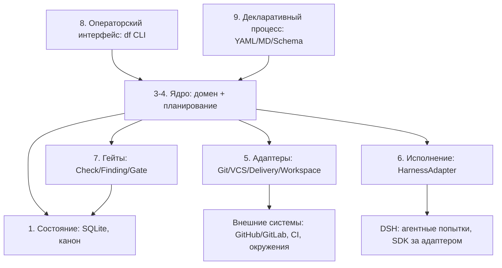

# Dark Factory v4 — HLD

Канонизированное высокоуровневое описание архитектуры. Источник — Notion v4
(страницы «Архитектура v4», 12 подстраниц), зафиксировано в ADR-0001…0013.
Решения открытых вопросов — `docs/analysis/2026-09-22-init-architecture-comparison.md` §4.

---

## 1. Цель и границы MVP

**Цель**: агентная фабрика разработки — конвейер, в котором изменения продуктов
(CRUD-системы SMALL: e-commerce, OMS/WMS/кассы/1С) проходят путь от оценки до поставки
через управляемые агентные попытки с гейтами и аудируемыми решениями.

**Границы MVP** (критерий готовности — Q5): разработка небольшой фичи существующего
Go/React-продукта и исправление воспроизводимого дефекта; оба сценария доходят до
тестового сервера с подтверждением результата.

**Вне MVP**: Console/Web UI, горизонтальное масштабирование, сторонние LLM-оркестраторы,
OKF-слой, DecisionPort, автономная production-доставка без политик риска.

## 2. Роли участников

- **Оператор** — запускает Change'и, отвечает на вопросы, принимает решения гейтов (CLI).
- **Ядро фабрики** — детерминированный владелец процесса и состояния; единственный
  источник решений (`accepted`, merge, доставка).
- **Агенты (в DSH)** — исполняют попытки по ролям/инструкциям; не владеют процессом.
- **Гейты** — проверки и политики, по которым ядро принимает вердикты.
- **Человек-решатель** — эскалация через `decision_required` / `human-decision`.

## 3. Слои системы

Один процесс, девять слоёв (не микросервисы):

1. **Состояние и транзакции** — SQLite-канон, короткие транзакции, журнал событий
   (ADR-0002).
2. **Планирование** — граф этапов процесса, условия запуска, лимиты (ADR-0003/0004).
3. **Контракты ядра** — zod-схемы домена, Gate/Harness-контракты (`@dark-factory/contracts`).
4. **Адаптеры** — границы к внешним системам, модули не сервисы (ADR-0006/0010).
5. **Исполнение** — попытки через DSH SDK за `DshAdapter` (ADR-0001).
6. **Агенты** — роли/инструкции/скиллы, исполняются в DSH, ядро их не оркестрирует LLM'ом.
7. **Гейты** — CheckRunner/GateEvaluator/FindingStore/ReworkController (ADR-0005).
8. **Операторский интерфейс** — CLI `df`, 6 команд, идемпотентность (ADR-0008).
9. **Декларативный процесс** — YAML/MD/JSON Schema, валидация до запуска (ADR-0004).

Принципы: ядро тонкое и детерминированное; нет второго LLM-оркестратора; не всё через DSH
(тесты, схемы, worktree — напрямую); Workflow Engine Spec Kit не используется.

## 4. Доменная модель

- `Change` — изменение продукта; `Run` — прогон процесса; `StageRun` — исполнение этапа
  с `generation`; `Attempt` — агентская попытка (одна Attempt → одна сессия DSH);
  `Artifact`; `Workspace`; `ExternalOperation` (`prepared/unknown`); `Question`/`Decision`.
- Состояния `StageRun`: `pending → ready → running → (waiting_input | reconciling) →
  evaluating → accepted | blocked | failed | cancelled`.
- Состояния `Run`: `created, running, waiting, succeeded, failed, cancelled`.
- Исполнители: `harness`, `command`, `integration`; гейт — внутри ядра.
- **retry ≠ rework**: `retry.max_attempts` — технические повторы; `rework.max_cycles` —
  циклы доработки новыми Attempt.
- Роли — конфигурации, не доменные сущности. Автооткат внешних действий запрещён.
  Event sourcing не нужен.

## 5. Декларативный процесс

- YAML `apiVersion: factory/v1`: `Process` (граф этапов), `Gate`, `Policy`,
  `ProductProfile`. Роли/инструкции/скиллы — Markdown с фронтматтером. Схемы — JSON Schema.
- Этап — контракт: условия запуска, исполнитель, поручение, результаты, принятие.
- Валидация `factory process validate/explain`; снимок конфигурации фиксируется на Run.
- Этап сужает разрешения; секреты — ссылки; **YAML — не язык программирования**
  (без eval/выражений).
- Спека-этапы подключаются как `instruction: provider: spec-kit`.

## 6. Контракт с DSH (Harness)

- SDK DSH скрыт в `DshAdapter`; ядро не импортирует SDK.
- **`HarnessRequest` v1**: `identity` (productId…attemptId), `executionKey`, `profileRef`,
  `workspace` (root, baseSnapshot), `context` (instruction, role, skills, inputs как
  `ArtifactRef{id, uri, sha256, mediaType}`), `outputs`, `policyRef`,
  `limits` (timeoutSeconds, maxModelRequests, maxCostUsd).
- **Операции адаптера**: `capabilities / start / inspect / events / submitInput / cancel /
  collect`.
- `ExecutionSnapshot`: `starting, running, waiting_input, reconciling, completed, failed,
  interrupted, cancelled`.
- **`HarnessResult`**: `outcome` (completed | failed | cancelled | interrupted), `artifacts`,
  `candidateSnapshot`, `agentReport` (структурированный файловый JSON-отчёт по схеме),
  `question`, `sessionRef`, `usage`, `error{retryable}`.
- `completed` ≠ прохождение гейта. Повторный `start` с тем же `executionKey` и другим
  содержимым — конфликт.

## 7. Окружения и воркспейсы

- Единица изоляции — **Attempt Workspace**:
  `workspace/{source, context, output, artifacts, temp, manifest.yaml}`.
- Режимы: **worktree (MVP)**, container, remote-runner, read-only.
- Ветки попыток: `factory/<change>/<stage>/attempt-N` + integration-ветка.
  Передача кода DSH ≠ merge.
- Лимиты: `max_active_attempts: 3`, `max_heavy_attempts: 1`. Leases не нужны —
  блокировка на уровне владельца SQLite.
- Retention: failed — 7 дней, successful — 24 часа, accepted_commits — постоянно.
- Восстановление: `resume / retry / reconcile`.

## 8. Гейты

- **Check ≠ Finding ≠ Gate**; ровно 4 исхода `GateResult`: `passed | rework_required |
  blocked | decision_required` (приоритет причин `blocked → decision_required →
  rework_required → passed`).
- Исчерпание лимита rework → `failed` решением ядра.
- Evidence привязан к субъекту: repository, commit, spec_digest, contracts_digest.
- Check-типы MVP: `artifact-exists, schema-valid, execution-succeeded, field-equals,
  same-subject, no-open-findings, human-decision`.
- `Finding` — объект (id, source, severity, status, expected/actual); `addressed ≠ закрыто`.
- Доработка — новая Attempt; в гейтах запрещены свободные выражения.
- Модули MVP: CheckRunner, GateEvaluator, FindingStore, ReworkController.

## 9. Состояние и операторский CLI

- SQLite — канон: сущности домена + вопросы/решения/внешние операции + компактный журнал.
  Один владелец состояния; второй run/resume — через IPC.
- Протокол артефактов: `temp → validate → rename → register`. Внешние операции:
  `prepared / unknown`; `unknown` блокирует слепой повтор.
- CLI `df`: `start / status / resume / cancel / submit-input / submit-decision`;
  `submit-input` = questionId + responseId + версия вопроса; идемпотентность по `commandId`
  (same+same → прежняя квитанция, same+diff → конфликт).

## 10. Git и доставка

- Четыре границы адаптеров: **Git / VCS / CI-CD / Deployment** (модули, не сервисы).
- Локальные проверки — primary; CI — доставка и независимое подтверждение.
- Одна integration-ветка на Change + одна MR; merge gate ≠ delivery gate;
  `pipeline: succeeded ≠ deployment: healthy`.
- `DeliveryAdapter`: `start / observe / cancel`; статусы merged / deployed / verified —
  раздельно.
- **Автономный merge — 5 условий**: принятый результат, проверки на текущем commit,
  правила защищённой ветки, нет блокирующих findings, политика риска разрешает.
- DSH не выдаются токены merge/production. Последовательная очередь интеграции.
- VCS-first — GitHub (Q4, ADR-0012); контракт VCS Provider допускает GitHub или
  GitLab в зависимости от задачи/продукта (ADR-0006).

## 11. Spec Kit и baseline

- Spec Kit — SDD-слой: процедуры constitution/specify/clarify/plan/tasks/analyze/
  implement/converge исполняются агентом через DSH; workflow engine не используется.
- Маршруты: **Assessment**, **SDD**, **BugFixing** (assessment — код не меняется → fix →
  test: verified/partial/failed).
- Хранение рядом с кодом: `.specify/`, `specs/<change>/`, `baseline/`,
  `.factory/product.yaml`, `baseline-impact.md`; фронтматтер
  (id, kind, status, introduced_by, relations); отдельный этап `baseline_update`;
  дублировать канонические источники запрещено.
- Рутизация: нарушение поведения → BugFixing; недостающая фича → SDD (converge);
  новое поведение → SDD. Единственный владелец процесса — ядро.

## 12. Релизная модель

- Неизменяемый релиз-комплект с манифестом: `factoryVersion, sourceCommit, artifactDigest,
  dshVersion, dependencyLockDigest, processPackDigest, knowledgeCommit, stateSchemaVersion,
  harnessContractVersion, rollbackPolicy`.
- Launcher: `df release install / activate / status / rollback`; откат = возврат артефакта;
  **откат программы ≠ откат действий/данных**; кандидат изолирован до активации.

### Стадии развития

| Стадия | Содержание |
|---|---|
| 0.1 Исполнение | ядро + DSH-адаптер, Attempt/StageRun, CLI start/status |
| 0.2 Процесс | декларативный процесс, гейты, доработка |
| 0.3 Разработка | маршруты Assessment/SDD/BugFixing через Spec Kit |
| 0.4 Релизы | комплект, launcher, откат |
| 0.5 Параллельность | лимиты попыток, очереди интеграции |
| 0.6 Доставка | DeliveryAdapter, merge/delivery-гейты |

## 13. Плагины

- Два уровня: фабрика / DSH. Plugin API `factory.plugin/v1`: манифест (id namespaced,
  entrypoint, requires, provides, configSchema, requestedPermissions — декларация, не
  выдача).
- Порты: плагины не меняют таблицы ядра, не выставляют `accepted`, не запускают следующий
  этап. Composition root выдаёт полномочия (пересечение запрошенного и допустимого).
- TypeScript-интерфейс — не граница безопасности; недоверенные — вне процесса.
- Точки расширения MVP: HarnessAdapter (только DSH), VCS Provider (один контракт;
  GitHub или GitLab по конфигурации, первый — GitHub), Delivery Provider (один),
  Workspace Provider (worktree), Instruction/Context Provider, Observer.

## 14. Безопасность

- Machine-аккаунт; роли allow/deny + write_scopes; этап сужает разрешения.
- Неповеренный продуктовый слой — в ограниченном окружении попытки.
- Секреты вне git (ссылки, подстановка в момент исполнения), redaction артефактов.
- DSH без токенов merge/production. Полномочия — минимально необходимые.

## 15. Ссылки

- ADR: `docs/adr/index.md` (ADR-0001…0013)
- Анализ и открытые вопросы: `docs/analysis/2026-09-22-init-architecture-comparison.md`
- Первоисточник: снимки — [docs/sources/notion-v4/](sources/notion-v4/00-index.md); оригинал — Notion [«Архитектура v4»](https://www.notion.so/3e2db33037c880808a7df4903877891a) (12 подстраниц)
- Процесс разработки: `AGENTS.md`
