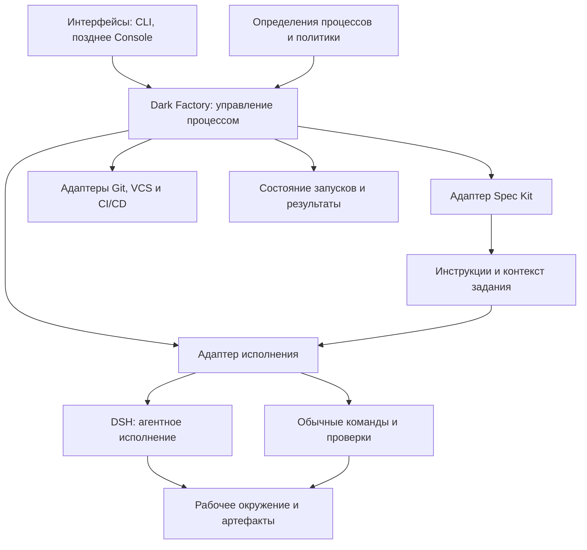

> **Снимок Notion от 2026-09-22**: [«Общая архитектура»](https://www.notion.so/3e2db33037c8801ea32fd339c569cc30) · не редактируется; канон архитектуры в репо — `docs/hld.md` и `docs/adr/`. Оригинал: Notion «Архитектура v4».

**Да, это разумная основа новой архитектуры: Dark Factory управляет жизненным циклом изменения, а DSH выполняет порученную агентную работу.** TypeScript позволяет реализовать управляющий слой и интеграцию с DSH в одном технологическом стеке.

Предлагаю раскрывать архитектуру последовательно: сначала зафиксировать карту слоёв и их границы, затем подробно разобрать каждый. Ниже — первоначальный вариант для валидации.

## Основной принцип разделения

У трёх центральных компонентов разные вопросы:

- **Dark Factory:** что запустить, с какими входными данными, когда считать этап завершённым и что делать дальше?
- **Spec Kit:** по каким инструкциям и шаблонам подготовить спецификацию, технический план и задачи?
- **DSH:** как агенту выполнить поручение — обратиться к модели, использовать инструменты, изменить файлы и вернуть результат?

В интеграции v4 отдельные процедуры Spec Kit используются как инструкции агенту. Поэтому адаптер Spec Kit готовит инструкции и артефакты для исполнения через harness. Наличие других механизмов upstream не меняет выбранную границу интеграции. [Документация Spec Kit](https://github.com/github/spec-kit/blob/main/README.md)

При этом **не всё исполнение стоит пропускать через DSH**. Запуск тестов, проверка схемы документа, создание worktree и получение статуса deployment могут быть обычными детерминированными операциями.

Это **логические границы модулей**, а не набор отдельных сервисов. Для локального MVP достаточно одного приложения фабрики, процессов DSH и локального хранилища. Единственный владелец процесса — ядро Dark Factory; встроенный Workflow Engine Spec Kit в v4 не используется.

**Граница MVP:** планируются заранее заданные этапы Process; `tasks.md` передаётся как артефакт. Автоматическое построение DAG задач и параллельная разработка нескольких веток относятся к последующему расширению. Тесты и ревью фиксированного снимка могут выполняться параллельно.

## 1. Слой взаимодействия — CLI и будущая Console

Его задача — дать человеку возможность управлять фабрикой:

- зарегистрировать продукт и его репозитории;
- инициировать фичу, исправление, исследование или изменение самой фабрики;
- посмотреть этап, результаты и причины блокировки;
- передать уточнение, остановить или продолжить работу;
- принять решение там, где этого требует политика.

CLI должен вызывать прикладные операции фабрики. **Логика процесса не должна находиться в обработчиках CLI-команд.** Тогда будущая Console использует те же операции без повторной реализации.

Для MVP: TypeScript, CLI и вывод событий в терминал. Постоянный HTTP-сервер пока не нужен.

## 2. Слой описания процесса — декларативные правила AI SDLC

Здесь находятся определения того, как фабрика работает:

| Артефакт | Что описывает |
|---|---|
| Процесс | Этапы, зависимости, переходы и точки остановки |
| Роль | Ответственность агента и необходимые навыки |
| Задание этапа | Входы, инструкции и ожидаемые результаты |
| Гейт | Какие доказательства нужны для продолжения |
| Политика | Допустимые действия, бюджеты, лимиты повторов и параллелизма |
| Профиль продукта | Репозитории, стек, команды проверки и целевые окружения |

Это соответствует твоему направлению: **инструкции и навыки — Markdown с YAML frontmatter; машинные правила — YAML**.

Например, процесс может описывать:

> Спецификация → техническое решение → задачи → реализация → проверка → доработка при замечаниях → интеграция → deployment.

Но исследование интерфейса может завершаться на прототипе, а исправление ошибки — использовать сокращённый процесс.

Mermaid здесь лучше генерировать из определения процесса: так схема и исполняемые правила не будут расходиться.

## 3. Слой оркестрации — небольшое детерминированное ядро

Это основная собственная логика Dark Factory.

Ядро:

1. Загружает процесс и создаёт запуск.
2. Определяет готовые к исполнению этапы.
3. Фиксирует входные данные и создаёт попытку выполнения.
4. Передаёт работу нужному исполнителю.
5. Сохраняет результат и проверяет условия перехода.
6. Продолжает процесс, запускает доработку или фиксирует блокировку.
7. Восстанавливает работу после остановки.

**Тонкий слой означает ограниченную ответственность, а не отсутствие надёжности.** Даже небольшому ядру нужны тайм-ауты, лимиты повторов, отмена и защита от повторного выполнения внешних действий.

Ключевая граница:

> Агент может сообщить «работа готова». Только фабрика переводит этап в «принято», проверив необходимые результаты.

Для этого не требуется второй LLM-оркестратор над DSH. Переходы между этапами можно выполнять обычным TypeScript-кодом по декларативным правилам.

## 4. Слой спецификаций и контекста — Spec Kit и знания продукта

Здесь фабрика определяет, **что именно передать агенту для конкретной работы**:

- запрос пользователя;
- актуальное описание продукта;
- спецификацию изменения;
- архитектурные ограничения;
- релевантные файлы и контракты;
- инструкции роли;
- замечания предыдущей проверки.

Адаптер Spec Kit отвечает за совместимость: подготовку структуры, выбор инструкций и шаблонов, расположение и обнаружение результатов. Не следует превращать его в собственную копию Spec Kit.

В текущем Spec Kit `plan` — технический план, а `tasks` — декомпозиция на исполняемые задачи. Эту семантику стоит сохранить в адаптере. [Описание SDD-процесса](https://github.com/github/spec-kit/blob/main/README.md)

Отдельно нужно различать:

- **baseline продукта** — что уже реализовано и принято;
- **спецификацию изменения** — что предлагается изменить;
- **результаты запуска** — что реально получилось и чем проверено.

После принятия изменения baseline обновляется отдельным контролируемым шагом.

## 5. Слой исполнения — DSH за адаптером

DSH получает ограниченное задание: например, подготовить технический план, реализовать группу задач или проверить изменения.

Он отвечает за агентный цикл, обращения к моделям, инструменты, сессии и работу с контекстом. В DSH эти возможности построены на плагинах Cordis; доступны headless-профиль и SDK, а сессии имеют собственный журнал. Это позволяет использовать его как самостоятельный runtime за адаптером фабрики. [Архитектура DSH](https://raw.githubusercontent.com/deepseek-ai/deepseek-harness/master/docs/architecture.md)

Предлагаемый контракт задания:

| Вход в harness | Результат для фабрики |
|---|---|
| Идентификатор запуска, этапа и попытки | Статус выполнения |
| Рабочая директория | Созданные и изменённые артефакты |
| Инструкции и ссылки на контекст | Структурированный итог |
| Разрешённые инструменты | Вопросы и блокирующие обстоятельства |
| Ограничения времени и бюджета | Ссылка на сессию и журнал |
| Требования к результату | Сведения о выполненных проверках |

**Процесс AI SDLC остаётся в фабрике; внутренний цикл работы агента — в DSH.** Если harness использует подагентов, это не должно создавать второй независимый источник статусов этапов фабрики.

Сменяемость harness лучше проверять на нескольких реальных операциях — запуск, отмена, получение результата и восстановление связи — без попытки заранее унифицировать все функции разных продуктов.

## 6. Слой рабочего окружения — где выполняется работа

Он управляет:

- локальными checkout и worktree;
- рабочими директориями попыток;
- доступом к зависимостям и инструментам;
- процессами и, при необходимости, контейнерами;
- сбором изменений и очисткой окружений.

Важно различать **разделение файлов и изоляцию исполнения**: worktree помогает агентам не перезаписывать чужие изменения, но не ограничивает доступ процесса к системе.

Для локального MVP разумно начинать с worktree и ограниченного параллелизма. Контейнерную изоляцию подключать там, где она требуется характером задания.

Фабрика владеет жизненным циклом рабочего окружения; DSH работает внутри предоставленного окружения.

## 7. Слой проверки и принятия результатов

Проверки нужны не только после написания кода:

- у спецификации — обязательные разделы, критерии приёмки и открытые вопросы;
- у технического решения — согласованность с ограничениями и контрактами;
- у реализации — тесты, анализ кода и соответствие требованиям;
- у deployment — результат развёртывания и smoke-проверки.

Здесь разделяются три действия:

> Инструменты дают измеримые результаты → агент может дать экспертную оценку → фабрика применяет правило принятия.

Отчёт ревьюера полезен, но не заменяет фактический результат тестов.

**Проверки привязываются к конкретной версии входов и кода.** Если после проверки код изменился, затронутые результаты необходимо пересмотреть.

С учётом твоего желания сократить задержки GitLab CI основные проверки можно выполнять локальным исполнителем. При этом результаты, версия кода и среда проверки должны быть зафиксированы.

## 8. Слой внешних интеграций — Git, GitLab/GitHub, трекер и CI/CD

Я бы разделил адаптеры по ответственности:

| Адаптер | Ответственность |
|---|---|
| Git | Локальные ветки, diff, commit, worktree и синхронизация |
| GitLab/GitHub | MR/PR, комментарии, статусы и merge |
| Трекер | Связь с внешней задачей и синхронизация выбранных статусов |
| CI/CD | Запуск pipeline, получение результата и отмена |
| Deployment | Сведения о версии в окружении и результате развёртывания |

В MVP CI/CD и deployment могут быть одним модулем, если это одна система.

**Git используется для версий и синхронизации, а рабочие чтения идут из локальных файлов и SQLite.** Внешний трекер также не должен быть обязательным для локального запуска.

CI/CD в этой архитектуре исполняет порученную часть доставки; общий жизненный цикл изменения контролирует фабрика.

## 9. Слой состояния и наблюдаемости

Для локального MVP предлагаю такое распределение:

| Данные | Основное место хранения |
|---|---|
| Процессы, роли, инструкции, политики | YAML и Markdown |
| Спецификации, решения, код | Локальные файлы с версионированием в Git |
| Запуски, этапы, попытки, блокировки | SQLite |
| Сессии агента | Хранилище DSH |
| Большие логи, отчёты, скриншоты | Каталог артефактов; ссылки в SQLite |
| Статус deployment | Внешняя система; локально — последнее наблюдение |

SQLite здесь — **оперативное состояние процесса**, а не просто индекс, который можно полностью восстановить из Git. Его нужно сохранять и резервировать вместе с необходимыми артефактами.

Минимальные понятия ядра:

- **Change** — изменение продукта.
- **Run** — запуск выбранного процесса.
- **Stage** — этап процесса.
- **Attempt** — конкретная попытка выполнения.
- **Artifact** — вход или результат.
- **Gate decision** — решение о продолжении с привязкой к проверенным версиям.

Отдельные сущности для каждой профессии агента не нужны: Product, Architect, Developer и Quality могут быть конфигурациями ролей.

## Как предлагаю двигаться дальше

Порядок детального раскрытия я бы выбрал такой:

1. **Ядро оркестрации:** его ответственность, сущности и состояния.
2. **Декларативный процесс:** что выражаем YAML/Markdown, а что требует кода.
3. **Контракт с DSH:** запуск, контекст, результаты, отмена и восстановление.
4. **Spec Kit и baseline:** жизненный цикл спецификаций.
5. **Рабочие окружения и параллельное выполнение.**
6. **Проверки, гейты и цикл доработки.**
7. **Git/VCS и доставка через CI/CD.**
8. [«Хранение состояния, CLI и будущая Console»](10-state-cli-console.md).

**Первым стоит зафиксировать ядро оркестрации.** Именно его границы определят, останется ли фабрика тонким управляющим слоем или снова начнёт дублировать harness, Spec Kit и CI/CD.
