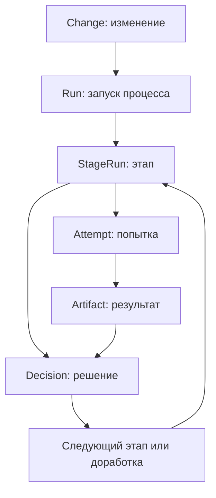
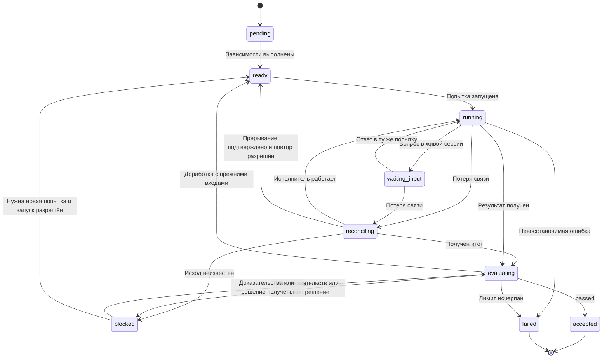

> **Снимок Notion от 2026-09-22**: [«Ядро Dark Factory»](https://www.notion.so/3e2db33037c880aea6b1e5d5eceeeb85) · не редактируется; канон архитектуры в репо — `docs/hld.md` и `docs/adr/`. Оригинал: Notion «Архитектура v4».

**Ядро Dark Factory — небольшой детерминированный диспетчер жизненного цикла изменения.** Оно знает, какой этап выполнить, выдаёт задание исполнителю, принимает результат и решает, можно ли двигаться дальше.

Оно пишется на **TypeScript**, работает локально через CLI, хранит оперативное состояние в SQLite и подключает DSH, Spec Kit, Git и CI/CD через адаптеры.

Ключевая граница:

> **Агент решает содержательную задачу. Ядро управляет выполнением и проверяет условия принятия результата.**

Ниже — предлагаемая конструкция ядра для MVP.

## 1. Чем именно управляет ядро

Единица управления — **запуск процесса над изменением продукта**.

Например:

> В продукт «Таск-трекер» добавить повторяющиеся задачи.

Фабрика создаёт изменение, выбирает процесс разработки и проводит его через этапы. Для разных запросов процессы могут отличаться:

| Запрос | Возможный процесс |
|---|---|
| Добавить функциональность | Спецификация → техническое решение → реализация → проверки → доставка |
| Исправить ошибку | Диагностика → исправление → проверки → доставка |
| Исследовать UI | Исследование → варианты → прототип → оценка |
| Проверить архитектуру | Сбор контекста → анализ → отчёт |
| Добавить плагин фабрики | Спецификация → разработка плагина → проверки → установка |

**В ядре нет зашитых этапов Product, Architecture или Development.** Оно исполняет определение процесса, а назначение этапов задаётся конфигурацией.

При этом для MVP я бы ограничил модель: **граф зависимостей этапов плюс явные ограниченные циклы доработки**. Произвольный язык программирования внутри YAML пока не нужен.

## 2. Минимальная модель данных

Шесть основных сущностей описывают процесс; Workspace, ExternalOperation, Question и журнальные записи дополняют модель исполнения.

| Сущность | Назначение | Пример |
|---|---|---|
| `Change` | Объединяет работу над одним изменением продукта | «Повторяющиеся задачи» |
| `Run` | Запуск определённой версии процесса | Полный цикл разработки |
| `StageRun` | Выполнение этапа для фиксированного набора входов; имеет stageRunId, stageId и generation | Реализация |
| `Attempt` | Одна попытка работы исполнителя | Вторая попытка после замечаний |
| `Artifact` | Версионированный вход или результат | Спецификация, diff, отчёт тестов |
| `Decision` | Зафиксированное решение о результате | Принять, доработать, запросить уточнение |

Связь между ними:



Несколько принципиальных деталей:

- Повторная попытка не затирает предыдущую.
- Повторный запуск процесса не уничтожает историю изменения.
- Артефакт имеет версию или хеш содержимого, а не только путь к файлу.
- Решение относится к конкретным версиям проверенных результатов.

Отдельную универсальную сущность `Agent` в ядре MVP я бы не вводил. Достаточно ссылки на профиль исполнителя и идентификатор сессии DSH в попытке.

А задачи из `tasks.md` можно первоначально хранить как артефакт Spec Kit. **Собственный планировщик каждой задачи из этого файла нужен только тогда, когда фабрика сама начнёт распределять их между независимыми исполнителями.**

## 3. Из каких внутренних модулей состоит ядро

Это модули одного приложения, без отдельных сервисов.

| Модуль | Что делает |
|---|---|
| **Прикладные операции** | Принимает команды `start`, `resume`, `cancel`, `submit-input` |
| **Загрузчик процесса** | Читает и проверяет определения процесса, фиксирует их версии |
| **Планировщик** | Находит готовые этапы, учитывает зависимости и лимит параллелизма |
| **Диспетчер исполнения** | Создаёт попытки и вызывает адаптеры |
| **Оценка гейтов** | Вычисляет GateResult по доказательствам; переход выбирает основной цикл ядра |
| **Хранилище и восстановление** | Сохраняет изменения состояния и сверяет незавершённые операции |

CLI — внешний интерфейс к этим модулям. Он не должен самостоятельно решать, какой этап запускать следующим.

Будущая Console сможет использовать те же прикладные операции.

## 4. Основной рабочий цикл

Ядро выполняет короткий повторяющийся цикл:

1. Читает текущее состояние запуска.
2. Сверяет состояние незавершённых попыток с исполнителями.
3. Находит этапы с выполненными зависимостями.
4. Проверяет наличие входов, разрешений и свободных слотов.
5. Фиксирует новую попытку.
6. Передаёт задание исполнителю.
7. Принимает результаты и регистрирует артефакты.
8. Применяет гейт и сохраняет переход.

**Один проход этого цикла не должен удерживать транзакцию SQLite, пока агент работает.** Транзакции короткие: зафиксировать намерение, сохранить результат, изменить статус.

LLM может работать несколько минут; база в это время доступна для просмотра статусов и других операций.

## 5. Состояния этапа



Состояние этапа и состояние исполнения различаются. `waiting_input` сохраняет прежние attemptId и сессию; `blocked` фиксирует причину и действие восстановления. Возобновление наблюдения или ответ человеку не создают новую попытку. Если живой исполнитель найден при сверке, он возвращается в фактически наблюдаемое состояние, включая waiting_input.

Запрос отмены хранится отдельно как cancel_requested. В `cancelled` этап переходит после подтверждённой остановки; если остановка неизвестна, остаётся reconciling/blocked. Уже выполненные внешние действия не откатываются автоматически.

**История и применимость результата разделены.** Принятый StageRun остаётся accepted для своих входов. Изменение входных артефактов создаёт новый StageRun того же stageId с новой generation и новым stageRunId. Предыдущие решения сохраняются, но не удовлетворяют зависимостям новой версии. Доработка всегда создаёт новую Attempt; если в неё передаются новые версии входов или замечания как новые входы, она принадлежит новой generation.

Применимость результата вычисляется по хешам входов, версии политики и снимку результата. При пересмотре требований ядро пересоздаёт затронутые выполнения, фиксирует выбранную generation каждого потребителя и исключает принятие запоздавших результатов старой generation.

Состояния Run: created, running, waiting, succeeded, failed, cancelled. Run считается waiting, когда нет исполняемых действий, но продолжение возможно; succeeded — когда все обязательные выходы актуальной generation приняты. Новая работа после завершённого Run оформляется новым Run.

## 6. Что ядро передаёт исполнителю

Используются три внешних исполнителя: harness, command, integration. Gate — внутренняя операция ядра.

Канонические HarnessRequest, HarnessResult, ExecutionSnapshot и операции адаптера описаны в [«Контракт с DSH»](04-dsh-contract.md). Общий дублирующий ExecutionRequest не вводится: каждый тип исполнителя имеет свой запрос и единый идентификационный конверт runId, stageId, stageRunId, attemptId.

Для harness ядро передаёт готовые версии входов и политику, получает handle, наблюдает состояние и после завершения собирает HarnessResult. waiting_input и reconciling — наблюдаемые состояния, а не успешные или терминальные результаты.

Command возвращает exit code, отчёты и проверяемый снимок; integration возвращает ссылку на внешнюю операцию и её наблюдаемый исход. blocked является состоянием этапа с причиной, а не альтернативным успешным результатом исполнителя.

Типы DSH и сообщения модели не входят в ядро. SDK и нормализация событий скрыты в адаптере.

## 7. Как работает принятие результата

Гейт — правило, которое проверяет наличие необходимых доказательств.

Например, для этапа реализации:

| Условие | Источник доказательства |
|---|---|
| Изменения подготовлены | Версия кода или зафиксированный снимок |
| Тесты прошли | Отчёт запуска тестов |
| Проверка типов прошла | Результат соответствующей команды |
| Нет блокирующих замечаний | Структурированный отчёт ревью |
| Проверены именно текущие изменения | Совпадение версии кода с версией в отчётах |

Ядро проверяет формальные условия. Содержательную оценку архитектуры или соответствия требованиям даёт отдельный агент либо человек, если этого требует процесс.

**Гейт не обязан означать ручное согласование.** Он может быть полностью автоматическим.

Единый GateResult: `passed`, `rework_required`, `blocked`, `decision_required`. Канонический контракт и схема Gate описаны в [«Проверки, гейты и цикл доработки»](07-gates-and-rework.md). GateEvaluator не выбирает следующий этап. Ядро применяет transitions процесса, проверяет бюджеты и создаёт попытку, ожидание или терминальный failed. Исчерпание бюджета — решение ядра, а не пятый исход гейта.

Сам набор правил лучше держать декларативным. Код реализует небольшой перечень проверок: наличие артефакта, валидность схемы, успешный exit code, допустимый verdict, совпадение версии.

## 8. Повтор после сбоя и доработка — разные операции

Это различие важно для предсказуемого поведения.

**Технический повтор** нужен, если работа не завершилась из-за временной ошибки:

> Соединение с моделью оборвалось; исполнитель недоступен; внешний API вернул временную ошибку.

**Доработка** нужна, если результат получен, но не принят:

> Тест выявил ошибку; ревью обнаружило нарушение контракта; не выполнен критерий приёмки.

У них должны быть разные счётчики и ограничения:

```yaml
retry:
  max_attempts: 2 # включая первоначальную попытку

rework:
  max_cycles: 3 # дополнительные циклы доработки

limits:
  max_run_duration_minutes: 90
```

После исчерпания лимита ядро сохраняет причину остановки и результаты. Оно не запускает бесконечный обмен между Developer и Reviewer.

Если замечания требуют изменения спецификации, процесс должен явно разрешать возврат к ней. Разработчик не должен незаметно менять согласованные требования ради прохождения тестов.

## 9. Лёгкое состояние и восстановление

Для локального MVP используется **один активный процесс управления на всю локальную рабочую область фабрики и SQLite на локальном диске**. Он может вести несколько Run; отдельный процесс CLI передаёт управляющую команду владельцу и не запускает второй планировщик. Протокол команд, хранения и восстановления описан в [«Хранение состояния, CLI и будущая Console»](10-state-cli-console.md).

В SQLite сохраняются:

- состояния запусков, этапов и попыток;
- ссылки на входы и результаты;
- решения гейтов;
- идентификаторы внешних операций;
- записи о запланированных, но ещё не подтверждённых действиях;
- компактная история переходов.

Текущие состояния хранятся обычными таблицами. Полный event sourcing для MVP не нужен.

Самый важный случай восстановления:

> Фабрика создала MR во внешней системе, но упала до сохранения ответа.

Простой повтор может создать второй MR. Поэтому ядро сначала фиксирует намерение и стабильный ключ операции, затем вызывает адаптер. При восстановлении адаптер проверяет, не выполнена ли операция уже.

Где внешняя система не поддерживает идемпотентность и результат нельзя надёжно определить, попытка остаётся с неопределённым исходом до сверки. **Неизвестный результат нельзя автоматически считать неуспехом и бездумно повторять.**

Такой механизм можно реализовать небольшой таблицей операций в SQLite — без отдельного брокера сообщений.

## 10. Как это работает через CLI

Для MVP достаточно режима, в котором процесс фабрики живёт, пока выполняется команда:

```bash
factory run --product tracker --flow feature --input intent.md
factory status <run-id>
factory resume <run-id>
factory cancel <run-id>
```

Это примеры будущего интерфейса.

- `run` создаёт запуск и начинает управление.
- `status` читает сохранённое состояние.
- `resume` сначала сверяет незавершённые операции, затем продолжает.
- `cancel` фиксирует запрос отмены и передаёт его активным исполнителям.

Закрытие терминала само по себе не гарантирует продолжение работы. Для автономной работы после закрытия терминала можно позднее добавить фоновый режим **того же ядра**, без отдельного workflow-продукта.

Также отмена не означает автоматический откат: уже созданный commit или завершившийся deployment остаются фактами. Откат — отдельная явно описанная операция.

## 11. Что позволяет ядру оставаться тонким

Я бы зафиксировал следующие границы:

| Ответственность | Владелец |
|---|---|
| Выбор следующего этапа | Ядро |
| Состояние процесса и попыток | Ядро |
| Применение гейтов | Ядро |
| Агентное рассуждение и инструменты | DSH |
| Методика и шаблоны спецификаций | Spec Kit через адаптер |
| Подготовка рабочего окружения | Workspace-адаптер |
| Содержимое спецификаций и кода | Артефакты продукта |
| Выполнение тестов | Исполнитель команд |
| Операции с MR и deployment | Интеграционные адаптеры |
| Представление результатов человеку | CLI / Console |

**Первую реализацию ядра стоит проверять одним сквозным сценарием:** задание агенту → результат → автоматическая проверка → одна доработка → принятие. Затем прервать процесс посередине и убедиться, что `resume` продолжает работу без потери результатов и дублирования внешних действий.

Это даст практическую проверку главного: фабрика умеет надёжно вести процесс, оставаясь небольшим управляющим приложением.
