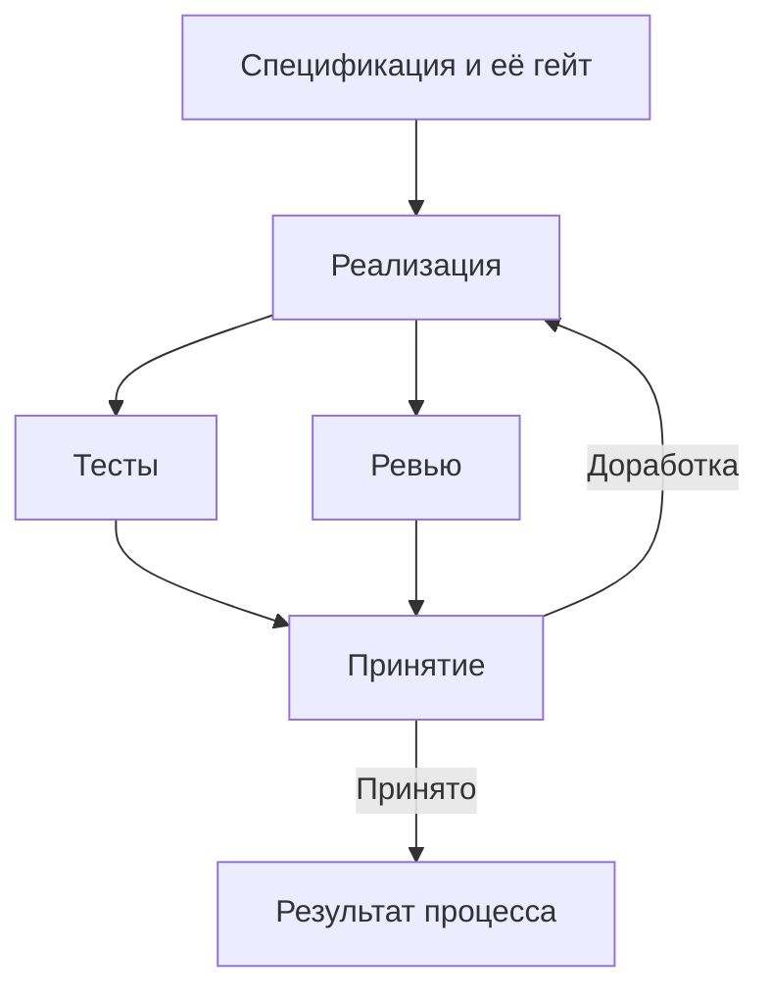

> **Снимок Notion от 2026-09-22**: [«Декларативный процесс»](https://www.notion.so/3e2db33037c88060b458f478e2b099cb) · не редактируется; канон архитектуры в репо — `docs/hld.md` и `docs/adr/`. Оригинал: Notion «Архитектура v4».

**Декларативный процесс — это описание работы фабрики в YAML и Markdown: какие этапы выполнить, кто их выполняет, какие результаты нужны и при каких условиях можно продолжать.**

Ядро интерпретирует это описание. DSH выполняет агентные задания. Изменение последовательности этапов, инструкций или критериев принятия обычно не требует изменения TypeScript-кода.

При этом декларативность имеет конкретную границу: **конфигурация комбинирует уже реализованные возможности.** Новый тип интеграции или принципиально новый механизм исполнения потребует адаптера.

## 1. Что входит в описание процесса

Предлагаю разделить определения на несколько небольших видов артефактов.

| Артефакт | Что определяет | Формат |
|---|---|---|
| Process | Этапы, зависимости, входы и результаты | YAML |
| Role | Ответственность агента и профиль исполнения | Markdown + YAML frontmatter |
| Instruction | Конкретное поручение для этапа | Markdown + YAML frontmatter |
| Skill | Повторно используемый способ выполнения работы | Markdown и связанные файлы |
| Gate | Формальные условия принятия результата | YAML |
| Policy | Разрешения, бюджеты, ограничения | YAML |
| Product profile | Настройки конкретного продукта | YAML |
| Schema | Структуру машинно проверяемого результата | JSON Schema |

**Process описывает порядок работы, Instruction — содержание работы, Gate — условия принятия.** Эти три ответственности лучше не смешивать в одном большом промпте.

Ниже приведён **предлагаемый формат Dark Factory**, а не существующий синтаксис DSH или Spec Kit.

## 2. Процесс — граф этапов с явными зависимостями

Пример: разработка небольшой фичи.

```yaml
apiVersion: factory/v1
kind: Process

metadata:
  id: feature
  version: 1.0.0

inputs:
  intent:
    type: artifact
    required: true
  baseline:
    type: artifact
    required: true

defaults:
  policy: policies/local-development.yaml

stages:
  specification:
    executor: harness
    role: roles/product.md
    instruction: instructions/specify.md

    inputs:
      intent: process.inputs.intent
      baseline: process.inputs.baseline

    outputs:
      spec:
        path: artifacts/spec.md
        type: markdown

    gate: gates/specification.yaml

  implementation:
    needs: [specification]

    executor: harness
    role: roles/developer.md
    instruction: instructions/implement.md

    inputs:
      spec: stages.specification.outputs.spec
      baseline: process.inputs.baseline

    outputs:
      candidate:
        type: workspace-snapshot
      implementation_report:
        path: artifacts/implementation-report.json
        schema: schemas/implementation-report.json

  tests:
    needs: [implementation]

    executor: command
    command: product.commands.test

    inputs:
      candidate: stages.implementation.outputs.candidate

    outputs:
      test_report:
        type: execution-report

  review:
    needs: [implementation]

    executor: harness
    role: roles/reviewer.md
    instruction: instructions/review.md

    inputs:
      spec: stages.specification.outputs.spec
      candidate: stages.implementation.outputs.candidate

    outputs:
      review_report:
        path: artifacts/review.json
        schema: schemas/review.json

  acceptance:
    needs: [tests, review]

    executor: gate
    definition: gates/implementation.yaml
    transitions:
      passed: complete
      rework_required:
        target: implementation
        feedback: [tests, review]
        max_cycles: 3
      blocked: wait
      decision_required: await-decision

    inputs:
      candidate: stages.implementation.outputs.candidate
      tests: stages.tests.outputs.test_report
      review: stages.review.outputs.review_report

outputs:
  candidate: stages.implementation.outputs.candidate
  specification: stages.specification.outputs.spec
```

Здесь ядро понимает, что:

- сначала нужно подготовить и принять спецификацию;
- затем можно выполнять реализацию;
- тесты и ревью не зависят друг от друга и могут идти параллельно;
- принятие реализации возможно после обоих результатов.



Для полного процесса можно добавить техническое решение, декомпозицию задач, интеграцию и deployment. Важно, что их добавление не меняет механизм ядра.

## 3. Этап — контракт работы

У каждого этапа должны быть явно определены:

1. **Условия запуска:** зависимости, необходимые входы.
2. **Исполнитель:** harness, обычная команда, интеграция или гейт.
3. **Поручение:** что необходимо сделать.
4. **Результаты:** какие артефакты вернуть.
5. **Условия принятия:** какие проверки пройти.
6. **Поведение при проблемах:** повтор, доработка, ожидание или остановка.

Не каждый этап требует отдельной роли, отдельного агента и отдельного документа. Например, проверка типов — обычная команда.

Также **не стоит делать каждый вызов инструмента этапом фабрики**. Прочитать файл, найти функцию, изменить код — внутренняя работа harness. Этап фабрики имеет самостоятельный, проверяемый результат.

## 4. Роль задаёт ответственность, инструкция — конкретную работу

Роль разработчика может выглядеть так:

```markdown
---
id: developer
executor_profile: dsh-developer
skills:
  - skills/repository-navigation
  - skills/testing
---

Ты отвечаешь за реализацию согласованного изменения.

Соблюдай архитектурные ограничения продукта.
Сохраняй совместимость публичных контрактов, если их изменение
не предусмотрено спецификацией.

При обнаружении противоречия в требованиях верни вопрос
или блокирующее замечание.
```

Инструкция этапа:

```markdown
---
id: implement-feature
version: 1.0.0
---

Реализуй изменение по входному артефакту `spec`.

1. Изучи релевантную часть текущей реализации.
2. Внеси необходимые изменения.
3. Добавь или обнови проверки изменённого поведения.
4. Подготовь отчёт о выполненных требованиях.

В отчёте укажи:
- выполненные критерии приёмки;
- оставшиеся ограничения;
- выполненные проверки;
- вопросы, требующие решения.
```

Одна роль может выполнять разные инструкции: новую фичу, исправление ошибки или доработку после ревью.

**Ограничения безопасности нельзя обеспечивать только текстом роли.** Например, запрет deployment должен применяться через разрешения исполнителя и адаптеров, а не исключительно через фразу в промпте.

## 5. Как подключается Spec Kit

Вместо собственной инструкции этап может ссылаться на возможность адаптера Spec Kit:

```yaml
instruction:
  provider: spec-kit
  operation: specify
  overlay: instructions/product-specification.md
```

Это декларация намерения: «использовать процедуру подготовки спецификации из подключённой версии Spec Kit и дополнить её нашими требованиями».

Адаптер:

- находит инструкции и шаблоны закреплённой версии;
- подготавливает их для DSH;
- согласует ожидаемые пути и форматы результатов;
- возвращает фабрике ссылки на созданные артефакты.

**Процесс не должен зависеть от того, как конкретный harness называет slash-команду.** Эта совместимость находится в адаптере.

В v4 единственный владелец переходов — Dark Factory. Адаптер подготавливает отдельные операции Spec Kit; Workflow Engine Spec Kit не запускается. После MVP другая модель возможна только как отдельное архитектурное решение.

## 6. Входы и выходы передаются явно

Главное правило: **этап получает конкретные версии артефактов, а не неопределённое «всё последнее из проекта».**

Например, ревью получает:

- спецификацию версии A;
- снимок кода версии B;
- архитектурные ограничения версии C.

Его результат действителен для этой комбинации.

Для работы с кодом нужен специальный тип результата — `workspace-snapshot`. Он представляет зафиксированное состояние кода, например commit либо иной воспроизводимый снимок.

Тесты и ревью должны работать с одним снимком. Если разработчик продолжает менять файлы, проверки предыдущего снимка не становятся автоматически доказательствами для нового.

Большие данные не передаются через YAML или SQLite целиком. Ядро передаёт ссылки, версии и метаданные.

## 7. Гейты описывают проверяемые условия

Пример гейта принятия реализации:

```yaml
apiVersion: factory/v1
kind: Gate
metadata:
  id: implementation-accepted
  version: 1
checks:
  - type: execution-succeeded
    input: tests
  - type: schema-valid
    input: review
    schema: schemas/review.json
  - type: field-equals
    input: review
    field: verdict
    value: approved
  - type: same-subject
    inputs: [tests, review]
    subject: candidate
  - type: no-open-findings
    inputs: [tests, review]
    severity: [critical, high]
    status: [open, disputed, addressed]
```

Схема Gate и семантика результатов канонически определены в [«Проверки, гейты и цикл доработки»](07-gates-and-rework.md). Политика описывает условия; маршрутизация находится в Process.

Ядру достаточно ограниченного набора типов проверок:

- артефакт существует;
- документ соответствует схеме;
- команда завершилась успешно;
- значение поля соответствует условию;
- доказательство относится к нужной версии;
- присутствует требуемое решение человека.

Свободный JavaScript или произвольные выражения внутри гейтов для MVP я бы не разрешал. Если нужен сложный анализ, отдельная команда или агент создаёт структурированный отчёт, а гейт проверяет его результат.

## 8. Доработка — явный возврат с пересмотром зависимых результатов

При возврате из `acceptance` в `implementation` ядро:

1. Создаёт новую Attempt реализации; при новых версиях входов или новом наборе feedback создаёт также новую generation StageRun.
2. Передаёт замечания тестов и ревью.
3. Получает новый снимок кода.
4. Помечает зависимые проверки как требующие повторного выполнения.
5. Повторно запускает тесты и ревью.
6. Снова применяет гейт.

Предыдущие отчёты сохраняются в истории, но не принимают новый код.

**Возврат к реализации не должен автоматически перезапускать спецификацию.** Повторяются только затронутые этапы по графу зависимостей.

Если требуется изменить саму спецификацию, это отдельный разрешённый переход. После её изменения пересматриваются все зависимые результаты.

Для MVP действует правило: **изменился выход этапа — создать новые выполнения зависимых потребителей**. Старые StageRun и решения остаются исторически принятыми для прежних входов. В зависимостях закрепляются stageRunId и хеши выходов, а не только stageId. Активные потребители устаревших входов отменяются или завершаются с сохранением результата только в истории; их результат не открывает гейт новой generation.

Граф needs остаётся ациклическим. Переход rework_required — отдельный ограниченный переход процесса; complete принимает текущий этап, после чего планировщик разрешает его зависимых потребителей. blocked и decision_required сохраняют ожидание без расходования цикла доработки. Лимиты учитываются на Run и логический цикл доработки и не обнуляются при смене generation.

## 9. Политики и настройки продукта

Процесс должен быть переносим между продуктами. Команды и особенности окружения задаются отдельно:

```yaml
apiVersion: factory/v1
kind: Product

metadata:
  id: task-tracker

repository:
  provider: gitlab
  default_branch: main

commands:
  test:
    argv: ["pnpm", "test"]
  typecheck:
    argv: ["pnpm", "typecheck"]

execution:
  max_parallel_stages: 2

policies:
  development: policies/local-development.yaml
  release: policies/release.yaml
```

Политика регулирует доступ и ограничения:

```yaml
apiVersion: factory/v1
kind: Policy

metadata:
  id: local-development

permissions:
  workspace_write: true
  vcs_push: false
  vcs_merge: false
  deploy: false

limits:
  stage_timeout_minutes: 30
  technical_retries: 2
  rework_max_cycles: 3
```

Секреты здесь не хранятся: только ссылки на способ их получения.

При объединении политик этап может **сузить разрешения**, но не самостоятельно расширить разрешённое продуктом. Конфликт ограничений должен выявляться до исполнения.

Лимит стоимости также требует поддержки учёта и остановки со стороны адаптера. Одна запись `max_cost` в YAML ещё не гарантирует жёсткого соблюдения бюджета.

## 10. Вопросы человеку и ручные решения

Для MVP полезно различать два случая.

**Уточнение по содержанию:** живое исполнение становится `waiting_input` и сохраняет attemptId и сессию. Ответ с questionId передаётся в эту же попытку. Если исполнитель уже остановлен, этап становится blocked с указанием причины; ядро отдельно решает, восстанавливать исполнение или создавать новую попытку.

**Обязательное решение:** процесс заранее требует подтверждения, например перед определённым deployment. Это отдельный гейт с человеческим решением.

Ответ или подтверждение сохраняется как артефакт с привязкой к проверяемой версии. Если версия существенно изменилась, старое подтверждение не переносится автоматически.

Для типовых небольших изменений процесс может вообще не содержать ручных гейтов.

## 11. Что валидируется до запуска

Команда вроде:

```bash
factory process validate processes/feature.yaml
```

должна проверять:

- корректность схем всех определений;
- существование ролей, инструкций, адаптеров и гейтов;
- отсутствие неизвестных ссылок на входы и выходы;
- совместимость типов артефактов;
- отсутствие циклических зависимостей `needs`;
- корректность явно заданных возвратов на доработку;
- наличие лимитов повторов;
- соответствие требуемых возможностей разрешениям исполнителя.

Полезна и команда:

```bash
factory process explain processes/feature.yaml \
  --product products/task-tracker.yaml
```

Она показывает уже разрешённый процесс: какие этапы запустятся, какие могут выполняться параллельно, какие команды будут вызваны и где возможна остановка.

**Mermaid-схему следует строить из этой же модели.** Тогда визуальное представление соответствует реальному процессу.

## 12. Версии процесса фиксируются на время запуска

При старте фабрика сохраняет снимок:

- определения процесса;
- инструкций и ролей;
- гейтов и политик;
- настроек продукта;
- версий адаптеров и выбранного harness-профиля.

Редактирование `developer.md` во время работы не должно незаметно менять уже запущенный процесс.

Обычный `resume` использует сохранённые определения. Переход на обновлённый процесс оформляется явно — в MVP проще новым запуском с повторным использованием только совместимых результатов.

## 13. Сколько декларативности нужно в первой версии

Я бы включил в MVP:

- последовательные и параллельные этапы через `needs`;
- явные входы и выходы;
- роли и инструкции в Markdown;
- четыре типа исполнителей: harness, command, integration, gate;
- формальные гейты;
- ограниченные технические повторы и доработки;
- вопросы человеку;
- версионирование определений;
- валидацию и генерацию схемы.

Динамическую генерацию графа агентом, вложенные процессы, сложные выражения и автоматическое создание сотен этапов лучше добавлять по конкретной потребности.

**Критерий удачной реализации:** ты можешь создать процесс «исследование UI» или добавить Security Review в процесс разработки, изменив несколько YAML/Markdown-файлов. TypeScript потребуется только тогда, когда фабрике понадобится действительно новая исполняемая возможность.
