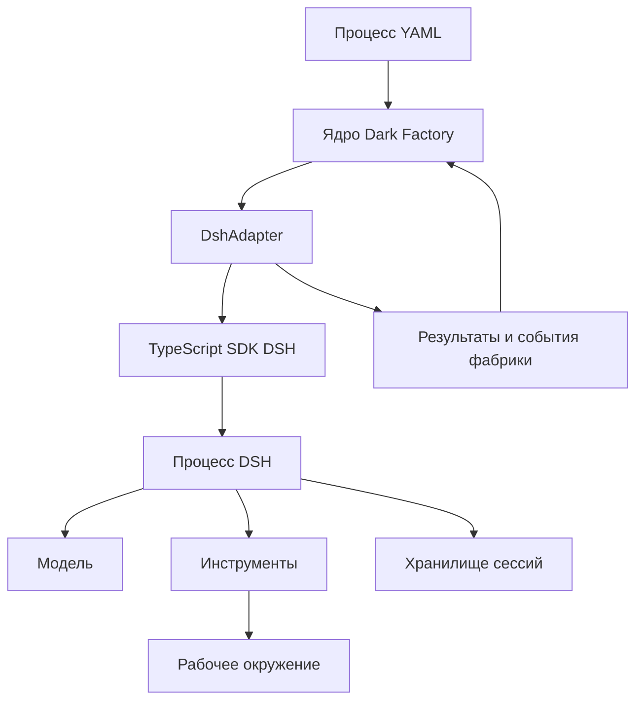

> **Снимок Notion от 2026-09-22**: [«Контракт с DSH»](https://www.notion.so/3e2db33037c880889e2ce380cc06fd28) · не редактируется; канон архитектуры в репо — `docs/hld.md` и `docs/adr/`. Оригинал: Notion «Архитектура v4».

**Контракт с DSH — это граница между управлением процессом и выполнением агентного задания.** Фабрика передаёт конкретное поручение, контекст, рабочее окружение и ограничения. Адаптер запускает DSH, отслеживает выполнение и возвращает проверяемый результат.

Основное правило:

> **DSH управляет работой агента внутри задания. Dark Factory управляет этапами, принятием результатов и дальнейшими действиями.**

Ниже — предлагаемый контракт фабрики. Названия интерфейсов и методов — проектируемый API Dark Factory, а не готовые методы DSH.

## 1. Как технически связать фабрику и DSH

Предлагаю использовать **TypeScript SDK DSH через отдельный адаптер**.

В документации DSH описано, что TypeScript SDK запускает совместимую версию `dsh` с профилем `sdk`; этот профиль предоставляет JSON-RPC-сервер. Конфигурация runtime задаётся профилями и patch-файлами. Поэтому фабрика может оставаться отдельным приложением и не встраивать Cordis в собственное ядро. [Архитектура DSH](https://raw.githubusercontent.com/deepseek-ai/deepseek-harness/master/docs/architecture.md)



SDK скрыт внутри адаптера. Остальные модули фабрики не импортируют типы DSH.

DSH сейчас обозначен как developer preview с возможными несовместимыми изменениями. Поэтому версии runtime, SDK и используемых плагинов нужно закреплять и обновлять совместно. [README DSH](https://raw.githubusercontent.com/deepseek-ai/deepseek-harness/master/README.md)

## 2. Граница ответственности

| Dark Factory | DSH |
|---|---|
| Выбирает готовый этап | Выполняет полученное агентное задание |
| Фиксирует входы и инструкции | Собирает контекст для обращений к модели |
| Предоставляет рабочее окружение | Использует доступные инструменты |
| Задаёт разрешения и ограничения | Применяет поддерживаемые механизмы ограничения |
| Управляет попытками и доработками | Выполняет внутренний цикл агента |
| Принимает результат через гейт | Возвращает результат и вопросы |
| Запускает следующие этапы | Сохраняет историю агентной сессии |

**Адаптер отвечает за перевод между этими двумя мирами:** подготовку запуска, привязку идентификаторов, передачу контекста, нормализацию событий и сбор результатов.

Он не должен самостоятельно решать, что после реализации пора делать deployment.

## 3. Единица исполнения — одна попытка этапа

Предлагаю базовое соответствие:

> **Один `Attempt` фабрики → одна основная сессия DSH.**

Например:

| Этап | Попытка | Сессия |
|---|---|---|
| Реализация | Первая реализация | Сессия A |
| Ревью | Первичная проверка | Сессия B |
| Реализация | Доработка по замечаниям | Сессия C |

Отдельная сессия ревью получает спецификацию и снимок кода. Историю рассуждений разработчика ей обычно передавать не нужно.

Новая попытка доработки получает предыдущий результат и замечания. Это позволяет контролировать контекст и сохранять историю попыток.

При этом **ответ на уточняющий вопрос внутри незавершённого задания может продолжать ту же попытку и сессию**. Он не обязательно создаёт новую попытку.

Внутренние подагенты DSH, если они используются, относятся к этой попытке. Их внутренние задачи не превращаются автоматически в этапы фабрики.

## 4. Контракт запуска

Запрос должен явно описывать пять вещей: идентичность задания, рабочую область, контекст, ожидаемые результаты и ограничения.

```typescript
interface HarnessRequest {
  contractVersion: "1";

  identity: {
    productId: string;
    changeId: string;
    runId: string;
    stageId: string;
    stageRunId: string;
    attemptId: string;
  };

  executionKey: string;
  profileRef: string;

  workspace: {
    workspaceId: string;
    root: string;
    baseSnapshot: string;
  };

  context: {
    instruction: ArtifactRef;
    role: ArtifactRef;
    skills: ArtifactRef[];
    inputs: Record<string, ArtifactRef>;
  };

  outputs: OutputContract[];

  policyRef: string;

  limits: {
    timeoutSeconds: number;
    maxModelRequests?: number;
    maxCostUsd?: number;
  };
}
```

Здесь:

- `attemptId` связывает работу с состоянием фабрики.
- `executionKey` — стабильный ключ запуска для защиты от повторного старта.
- `profileRef` — ссылка на закреплённую конфигурацию исполнения.
- `baseSnapshot` — точная исходная версия рабочей области.
- `ArtifactRef` — ссылка на артефакт с идентификатором и хешем.
- `OutputContract` — описание обязательного результата: тип, расположение и схема.

Пример ссылки:

```typescript
interface ArtifactRef {
  id: string;
  uri: string;
  sha256: string;
  mediaType: string;
}
```

URI разрешает адаптер: это может быть локальный файл или объект, который нужно предварительно материализовать в рабочем окружении. Агенту не требуется доступ к внутреннему хранилищу фабрики.

## 5. Как передавать контекст

Для MVP лучше передавать **не один огромный промпт, а подготовленный пакет файлов и короткое стартовое поручение**.

| Часть контекста | Содержание |
|---|---|
| Инструкция | Что выполнить и какой результат вернуть |
| Роль | Ответственность и правила работы |
| Спецификация | Требования текущего изменения |
| Baseline | Релевантное описание существующего продукта |
| Ограничения | Архитектура, контракты, соглашения |
| Обратная связь | Замечания предыдущей проверки |
| Манифест | Идентификаторы, версии и расположение входов |

Адаптер проверяет хеши и доступность входов до запуска.

**Состав входов фиксируется на попытку.** Если пользователь изменил спецификацию в процессе работы, фабрика явно решает: продолжить по старой версии, остановить попытку или начать новую.

Тексты из репозитория, внешних документов и результатов инструментов должны передаваться как данные с указанием происхождения. Они не должны самостоятельно расширять разрешения или менять правила процесса.

## 6. Минимальные операции адаптера

Предлагаю такой интерфейс:

```typescript
interface HarnessAdapter {
  capabilities(): Promise<HarnessCapabilities>;

  start(request: HarnessRequest): Promise<ExecutionHandle>;

  inspect(handle: ExecutionHandle): Promise<ExecutionSnapshot>;

  events(
    handle: ExecutionHandle,
    after?: string
  ): AsyncIterable<HarnessEvent>;

  submitInput(
    handle: ExecutionHandle,
    input: ExecutionInput
  ): Promise<InputReceipt>;

  cancel(
    handle: ExecutionHandle,
    reason: string
  ): Promise<CancelReceipt>;

  collect(handle: ExecutionHandle): Promise<HarnessResult>;
}
```

| Операция | Семантика |
|---|---|
| `capabilities` | Какие возможности реально доступны в выбранной конфигурации |
| `start` | Начать выполнение или вернуть уже связанное с ключом исполнение |
| `inspect` | Получить наблюдаемое состояние без повторного запуска |
| `events` | Читать нормализованные события выполнения |
| `submitInput` | Передать ответ на конкретный вопрос |
| `cancel` | Запросить остановку |
| `collect` | Собрать и проверить комплект результатов |

`start` возвращает дескриптор исполнения, а не ждёт окончания всей агентной работы.

Канонические состояния ExecutionSnapshot: starting, running, waiting_input, reconciling, completed, failed, interrupted, cancelled. Ожидание вопроса не является HarnessResult; collect возвращает терминальный результат только после подтверждения завершения. При потере связи адаптер сообщает reconciling, а не interrupted.

Идентификаторы и состояние снимка:

```typescript
interface ExecutionHandle {
  executionId: string;
  attemptId: string;
  stageRunId: string;
  executionKey: string;
}
interface ExecutionSnapshot {
  handle: ExecutionHandle;
  state: "starting" | "running" | "waiting_input" | "reconciling"
    | "completed" | "failed" | "interrupted" | "cancelled";
  observedAt: string;
  cancelRequested: boolean;
  question?: InputRequest;
}
```

capabilities/start/inspect/collect и запрос cancel составляют обязательную границу MVP. Если штатная отмена harness отсутствует, локальный адаптер должен уметь остановить принадлежащую ему группу процессов и подтвердить остановку; иначе профиль не допускается к автономной изменяющей код работе. Неподдерживаемые events/submitInput возвращают явную ошибку capability, а не имитируют поддержку. events, интерактивный ввод и восстановление живой сессии доступны только при подтверждённых capabilities. Если интерактивность отсутствует, задание завершается с машиночитаемой причиной INPUT_REQUIRED; ядро сохраняет вопрос, блокирует этап и после ответа создаёт новую попытку. Наличие интерфейса не утверждает готовую поддержку каждого метода текущим SDK DSH.

Повторный `start` с тем же ключом и другим содержимым запроса должен завершаться конфликтом. Один executionKey относится к одной Attempt: повтор доставки запроса использует прежний ключ, технический retry и доработка создают новые attemptId и executionKey. stageRunId связывает исполнение с фиксированными входами; запоздавший результат предыдущей generation сохраняется в истории и не принимается вместо текущего. Защиту от дубликатов реализует адаптер совместно с хранилищем фабрики; нельзя предполагать, что DSH автоматически предоставляет такую семантику.

## 7. Доступные возможности нужно проверять заранее

Не каждый профиль harness обеспечивает одинаковые гарантии. Поэтому адаптер объявляет возможности:

```typescript
interface HarnessCapabilities {
  interactiveInput: boolean;
  eventStream: boolean;
  cancellation: boolean;
  durableSessionRecovery: boolean;

  isolation: "none" | "process" | "container";

  enforcedLimits: {
    timeout: boolean;
    modelRequests: boolean;
    cost: boolean;
  };
}
```

Если процесс требует контейнерной изоляции, а профиль её не предоставляет, запуск отклоняется **до исполнения**.

Особенно это важно для бюджета: `maxCostUsd` может означать жёсткое ограничение только при наличии достоверного учёта и механизма остановки. Иначе это оценочный порог, что должно быть явно отражено в конфигурации.

## 8. События: что видеть ядру и пользователю

Ядру нужен небольшой набор событий:

| Событие | Значение |
|---|---|
| `execution.started` | Исполнение действительно началось |
| `execution.progress` | Краткое сообщение о ходе работы |
| `input.required` | Нужен ответ или внешнее решение |
| `artifact.discovered` | Обнаружен кандидат на выходной артефакт |
| `usage.updated` | Обновилась статистика использования |
| `execution.finished` | Попытка завершилась |
| `execution.failed` | Зафиксирована ошибка выполнения |

Оболочка события:

```typescript
interface HarnessEvent {
  eventId: string;
  executionId: string;
  attemptId: string;
  cursor: string;
  occurredAt: string;

  type: string;
  payload: unknown;
}
```

События могут доставляться повторно; ядро устраняет дубликаты по `eventId`. Курсор относится к конкретному исполнению.

**Поток текста агента — отдельная необязательная телеметрия для UI.** Он не должен управлять переходами этапов.

В DSH различаются долговечные события сессии и события текущего исполнения. Адаптер должен учитывать это различие: нельзя обещать восстановление каждого показанного в UI фрагмента после аварийного завершения процесса. [Модель событий DSH](https://raw.githubusercontent.com/deepseek-ai/deepseek-harness/master/docs/architecture.md)

## 9. Контракт результата

Результат формирует адаптер на основании наблюдаемого завершения, файлов и валидированного отчёта агента.

```typescript
interface HarnessResult {
  attemptId: string;
  stageRunId: string;
  executionId: string;

  outcome:
    | "completed"
    | "failed"
    | "cancelled"
    | "interrupted";

  artifacts: ArtifactRef[];
  candidateSnapshot?: string;

  agentReport?: ArtifactRef;
  question?: InputRequest; // для завершённого задания с INPUT_REQUIRED
  sessionRef?: string; // отсутствует, если сессия не успела создаться

  usage?: {
    inputTokens?: number;
    outputTokens?: number;
    estimatedCostUsd?: number;
  };

  error?: {
    code: string;
    message: string;
    retryable: boolean;
  };
}
```

Здесь важно разделение:

- **Отчёт агента:** что он утверждает о выполненной работе.
- **Наблюдения адаптера:** какие файлы существуют, какие схемы пройдены, какой снимок кода получен.
- **Решение фабрики:** принят ли результат этапа.

`completed` означает, что исполнение завершилось и обязательный комплект результатов собран. Это **не** означает, что требования удовлетворены и гейт пройден.

Процесс DSH с успешным exit code, но без обязательного отчёта — ошибка контракта результата.

## 10. Как получать структурированный итог

Для MVP предлагаю простой файловый протокол:

1. Адаптер передаёт схему итогового отчёта и путь для его записи.
2. Агент создаёт отчёт.
3. Адаптер дожидается завершения исполнения.
4. Проверяет файл по схеме.
5. Проверяет ссылки на результаты.
6. Фиксирует снимок изменённой рабочей области.
7. Возвращает `HarnessResult`.

Пример отчёта агента:

```json
{
  "summary": "Добавлена поддержка повторяющихся задач",
  "addressedRequirements": ["REQ-12", "REQ-13"],
  "remainingIssues": [],
  "checksReported": [
    {
      "name": "unit-tests",
      "outcome": "passed"
    }
  ]
}
```

Поле `checksReported` — заявление агента. Если гейт требует независимых тестов, фабрика запускает их отдельным исполнителем на полученном снимке кода.

При необходимости позднее можно добавить DSH-плагин с инструментом структурированной отправки результата. Для первого рабочего контракта такой плагин не обязателен.

## 11. Вопросы пользователю

Ожидание ответа лучше моделировать как **незавершённое исполнение в состоянии `waiting_input`**.

Вопрос содержит:

```typescript
interface InputRequest {
  questionId: string;
  kind: "clarification" | "permission";
  text: string;
  options?: string[];
}
```

Ответ должен ссылаться на `questionId` и иметь собственный идентификатор для устранения дубликатов.

Пример:

> Требование допускает перенос повторяющейся задачи на выходной? Выбрать ближайший рабочий день или сохранить исходную дату?

Фабрика сохраняет вопрос, показывает его через CLI/Console и передаёт ответ через адаптер.

Важно различать уточнение требований и разрешение операции. Текстовый ответ на вопрос о требованиях не должен автоматически повышать права исполнителя.

## 12. Остановка, потеря связи и восстановление

Это три разных ситуации.

| Ситуация | Поведение |
|---|---|
| Пользователь запросил отмену | Зафиксировать запрос, остановить исполнение, проверить завершение |
| Фабрика потеряла связь с DSH | Сначала установить фактическое состояние |
| Процесс DSH аварийно завершился | Сохранить частичные результаты и определить возможность восстановления |

`cancel` возвращает подтверждение получения запроса. Статус `cancelled` появляется после подтверждённой остановки.

При превышении времени ожидания адаптер может завершить принадлежащий ему процесс и его дочерние процессы средствами рабочего окружения. Простого закрытия SDK-соединения недостаточно.

После перезапуска фабрика:

1. Находит незавершённые попытки.
2. Проверяет исполнение и связанную сессию.
3. Собирает результат, если работа завершилась.
4. Возобновляет наблюдение, если работа продолжается.
5. Фиксирует `interrupted`, если выполнение оборвалось.
6. Передаёт ядру решение о новой попытке или восстановлении.

**Восстановление истории сессии не гарантирует безопасный повтор последнего действия.** Например, команда могла изменить файл до аварии. Сначала нужно сверить рабочую область и фактические последствия.

Для MVP разумно поддержать надёжное обнаружение прерывания и запуск новой попытки из проверенного состояния. Автоматическое продолжение произвольной незавершённой сессии можно добавить после проверки конкретного SDK.

## 13. Разрешения и рабочее окружение

Фабрика передаёт политику, а адаптер обязан обеспечить её поддерживаемыми средствами.

Для обычного Developer:

- запись в выделенную рабочую область;
- доступ к необходимым инструментам;
- запуск разрешённых проверок;
- отсутствие полномочий на merge и production deployment.

Если агент имеет unrestricted shell и доступные credentials, запрет инструмента `deploy` сам по себе ничего не гарантирует. Ограничения должны учитывать окружение процесса, файловую систему и доступные секреты.

Рабочую область создаёт Workspace-адаптер. DSH получает готовое окружение и не решает, какие рабочие области других запусков можно удалить.

## 14. Что потребуется реализовать

Для первой версии достаточно:

| Компонент | Назначение |
|---|---|
| `DshAdapter` | Реализация контракта фабрики |
| Подготовка контекста | Материализация инструкций и входных артефактов |
| Конфигурации DSH | Профили исполнения ролей и политики |
| Нормализация событий | Преобразование событий в формат фабрики |
| Сборщик результатов | Проверка файлов, схем и снимка кода |
| Учёт исполнения | Связь Attempt, execution key и сессии DSH |

Собственный DSH-плагин стоит добавлять только при подтверждённой потребности: например, если SDK не даёт нужного способа задавать вопросы или фиксировать структурированный результат.

**Проверка контракта должна покрыть шесть сценариев:** успешное задание, некорректный результат, уточняющий вопрос, отмену, повторный запуск с тем же ключом и аварийное завершение.

Так фабрика получает устойчивую границу исполнения: **выдать задание → наблюдать → получить проверяемые результаты**, сохраняя весь AI SDLC и правила принятия в собственном тонком ядре.
