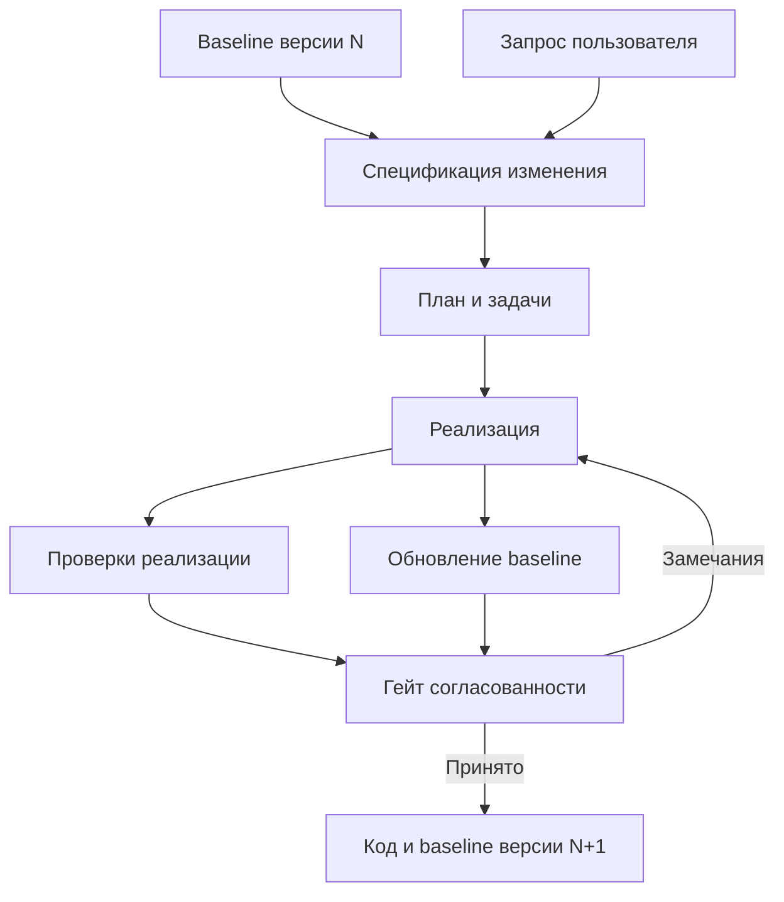

> **Снимок Notion от 2026-09-22**: [«Spec Kit и baseline»](https://www.notion.so/3e2db33037c8804c9d19f07952fd425d) · не редактируется; канон архитектуры в репо — `docs/hld.md` и `docs/adr/`. Оригинал: Notion «Архитектура v4».

**Spec Kit отвечает за подготовку и реализацию конкретного изменения. Baseline хранит актуальное согласованное описание продукта. Dark Factory связывает их: передаёт исходный контекст, управляет проверками и обновляет baseline после принятия изменения.**

Для новой архитектуры предлагаю модель:

> **Актуальный baseline + спецификация изменения → реализация и проверки → обновлённый baseline.**

При этом спецификации завершённых изменений сохраняются как история решений.

## 1. Разделить три вида информации

| Вид | На какой вопрос отвечает | Пример |
|---|---|---|
| **Baseline продукта** | Как устроена и работает принятая версия продукта? | Какие типы задач существуют, кто может их изменять |
| **Спецификация изменения** | Что требуется добавить или поменять? | Добавить повторяющиеся задачи |
| **Результаты исполнения** | Что сделано и чем проверено? | Diff, отчёт тестов, ревью, версия сборки |

Главная ошибка — считать каталог всех исторических спецификаций актуальным описанием продукта. В них могут находиться отменённые требования, заменённые решения и незавершённые изменения.

**Агенту нужен baseline как исходная точка, а история изменений — для объяснения причин и поиска контекста.**

## 2. Что берём из Spec Kit

В v4 используем отдельные процедуры Spec Kit для подготовки требований, технического плана, задач, реализации и проверки полноты. Их исполняет агент через DSH; CLI Spec Kit используется для установки и подготовки проекта. Это выбранный режим интеграции, а не полный перечень возможностей CLI. Workflow Engine Spec Kit не используется. [Документация Spec Kit](https://github.com/github/spec-kit)

Предлагаемое распределение:

| Возможность Spec Kit | Использование в фабрике |
|---|---|
| `constitution` | Общие принципы разработки продукта |
| `specify` | Требования и сценарии изменения |
| `clarify` | Уточнение неоднозначностей |
| `plan` | Техническое решение и подход к реализации |
| `tasks` | Декомпозиция реализации |
| `analyze` | Проверка согласованности спецификации, плана и задач |
| `implement` | Исполнение ограниченного объёма задач через DSH |
| `converge` | Поиск оставшихся расхождений реализации с артефактами |

Здесь `plan` — технический план, а `tasks` — исполняемая декомпозиция. `converge` может дописывать оставшиеся задачи, но его вывод не заменяет независимые проверки фабрики. [Справочник процедур Spec Kit](https://github.github.io/spec-kit/reference/agentic-sdd.html)

**Не нужно заново реализовывать эти процедуры в ядре.** Фабрика добавляет управление исполнением, привязку версий, проверяемые гейты и работу с baseline.

Для discovery и bugfix адаптер также подготавливает отдельные процедуры Assessment и Bug Fixing. Маршрутизацию выполняет Process Dark Factory. Для bugfix сохраняются `assessment.md`, `fix.md` и `test.md`; полный комплект spec/plan/tasks не обязателен. Исправление реализации существующего поведения не обязано менять нормативный baseline. Assessment сохраняет исследование и решение, но не объявляет гипотезу реализованной возможностью.

## 3. Какую модель спецификаций выбрать

Spec Kit описывает несколько вариантов ведения спецификаций: исторические каталоги изменений, живую спецификацию и согласование артефактов после обнаружений в реализации. [Модели эволюции спецификаций](https://github.github.io/spec-kit/guides/evolving-specs.html)

Для Dark Factory предлагаю сочетание:

- **Спецификации изменений:** после завершения сохраняются как историческая запись.
- **Baseline:** поддерживается как актуальное описание принятой версии продукта.
- **Во время разработки:** обнаруженные противоречия могут приводить к пересмотру спецификации через явный переход процесса.

Это наше архитектурное решение. Автоматическое продвижение изменений в baseline должен обеспечить процесс фабрики.

## 4. Что входит в baseline

Baseline — набор небольших связанных документов и машиночитаемых контрактов.

| Раздел | Содержание |
|---|---|
| Продукт | Назначение, границы, основные возможности |
| Поведение | Пользовательские сценарии и правила |
| Домен | Сущности, термины, инварианты |
| Архитектура | Компоненты, границы ответственности, взаимодействия |
| Контракты | API, события, схемы данных |
| Интерфейс | Экраны, состояния, навигация, ссылки на UIKit |
| Нефункциональные требования | Производительность, доступность, безопасность |
| Решения | Принятые ADR и ссылки на заменённые решения |

**В baseline не нужно копировать то, что уже имеет канонический источник.**

Например:

- точная API-схема живёт в OpenAPI;
- SQL-структура — в миграциях;
- описание компонента UI — рядом с компонентом или в Storybook;
- baseline содержит объяснение и ссылки на эти источники.

Иначе фабрика будет постоянно синхронизировать несколько копий одной информации.

Конституция также имеет отдельное назначение: она описывает **обязательные принципы**, а baseline — **принятое устройство и поведение продукта**.

## 5. Где хранить baseline

Для упрощённого MVP я рекомендую **хранить baseline рядом с кодом продукта**, сохраняя стандартные каталоги Spec Kit.

| Путь | Назначение |
|---|---|
| `.specify/` | Настройки, шаблоны и служебные файлы Spec Kit |
| `.specify/memory/constitution.md` | Принципы продукта |
| `specs//spec.md` | Спецификация изменения |
| `specs//plan.md` | Технический план |
| `specs//tasks.md` | Задачи |
| `specs//baseline-impact.md` | Предлагаемые изменения baseline |
| `baseline/` | Актуальное описание продукта |
| `.factory/product.yaml` | Настройки продукта для фабрики |

`baseline-impact.md` и каталог `baseline/` здесь — наши дополнения.

Это **пересмотр прежней идеи об обязательном отдельном knowledge-репозитории**: для нового тонкого решения совместное хранение упрощает согласованность кода и документации. Один commit может содержать оба изменения.

Отдельный knowledge-репозиторий оправдан, если продукт охватывает несколько репозиториев или знания имеют собственный процесс доступа и публикации. Тогда нужен манифест, связывающий точные версии кода и baseline: межрепозиторной атомарности у Git нет.

Если сохраняем OKF, его можно использовать как формат документов и связей внутри baseline. Отдельный сервер графа для MVP не требуется.

## 6. Как описывать документы

Твоё предпочтение Markdown с YAML frontmatter здесь подходит.

Например, документ baseline:

```markdown
---
id: capability.task-recurrence
kind: capability
status: accepted
introduced_by: CHG-0042
relations:
  - domain.task
  - api.tasks
---

# Повторяющиеся задачи

Пользователь может настроить повторение задачи
по выбранному расписанию.

## Правила

- Расписание учитывает часовой пояс пользователя.
- Отключение повторения не удаляет уже созданные задачи.
- Изменение расписания применяется к будущим созданиям.
```

Метаданные нужны для идентификации, связей и проверки ссылок. Полный технический снимок baseline лучше фиксировать один раз в манифесте запуска, а не добавлять текущий commit в каждый документ.

Для артефактов Spec Kit frontmatter следует добавлять через проверенные настройки шаблонов. Если конкретная процедура несовместима с дополнительными метаданными, их можно временно хранить в соседнем манифесте. Совместимость адаптера важнее одинакового оформления всех файлов.

## 7. Как проходит изменение

Рассмотрим добавление повторяющихся задач.

### Шаг 1. Зафиксировать исходную версию.

Фабрика выбирает:

- версию кода;
- версию baseline;
- конституцию;
- версии процедур Spec Kit;
- инструкции и политики процесса.

Агенты разных этапов получают согласованный исходный контекст.

### Шаг 2. Выбрать релевантную часть baseline.

Для этого изменения нужны сведения о задачах, правах, расписаниях, часовых поясах и текущем API.

Фабрика формирует пакет контекста с явными ссылками. Для MVP достаточно связей документов, поиска по локальным файлам и при необходимости SQLite FTS.

Необязательно передавать весь baseline каждому агенту.

### Шаг 3. Подготовить спецификацию через Spec Kit.

Входы:

> Запрос пользователя + релевантный baseline + ограничения.

Результат описывает желаемое поведение и явно выделяет изменения:

- что добавляется;
- что меняется;
- что должно сохранить совместимость;
- какие вопросы остаются открытыми.

Спецификация должна быть понятна сама по себе, поэтому это не только механический diff документов.

### Шаг 4. Подготовить техническое решение и задачи.

Spec Kit помогает сформировать план и декомпозицию. Фабрика проверяет их согласованность с требованиями и текущей архитектурой.

### Шаг 5. Выполнить реализацию и проверки.

DSH работает по ограниченному заданию. Фабрика фиксирует снимок реализации и запускает необходимые проверки.

### Шаг 6. Подготовить обновление baseline.

Агент формирует изменения актуальных документов по фактически реализованному и принятому поведению:

- описание новой возможности;
- изменения доменных правил;
- ссылки на обновлённые контракты;
- необходимые ADR;
- ограничения, которые действительно остались.

### Шаг 7. Принять и интегрировать комплект.

Код, спецификация и обновление baseline проходят согласованные проверки и интегрируются вместе.



При замечаниях к требованиям процесс возвращается к спецификации, а не только к коду.

## 8. Когда baseline становится актуальным

Нужно различать:

| Состояние | Значение |
|---|---|
| Предлагаемое изменение | Ещё находится в разработке |
| Принятое в основной ветке | Код и описание интегрированы |
| Выпущенное | Входит в определённый release |
| Развёрнутое | Присутствует в конкретном окружении |
| Включённое | Доступно пользователям с учётом feature flags |

**Baseline основной ветки не обязательно описывает текущий production.**

Поэтому baseline имеет версию, а release/deployment-манифест указывает, какая версия кода и baseline соответствует окружению. Сведения о включённых флагах дополняют эту картину.

Не нужно переписывать весь baseline после каждого deployment. Нужно правильно связать версии.

## 9. Что делает адаптер Spec Kit

Его ответственность достаточно узкая:

| Операция | Результат |
|---|---|
| Проверить установку | Подтверждена совместимая закреплённая версия |
| Подготовить рабочую область | Доступны нужные инструкции и шаблоны |
| Подготовить операцию | Сформировано задание для DSH |
| Найти результаты | Получены ссылки на spec, plan, tasks и другие файлы |
| Проверить структуру | Обнаружены отсутствующие или некорректные артефакты |
| Нормализовать отчёт | Результат доступен гейтам фабрики |

Предлагаемый интерфейс:

```typescript
interface SpecAdapter {
  prepare(
    operation: SpecOperation,
    context: SpecContext
  ): Promise<PreparedHarnessTask>;

  collect(
    operation: SpecOperation,
    workspace: WorkspaceRef
  ): Promise<SpecArtifacts>;
}
```

Это API фабрики.

Адаптер **не вызывает LLM самостоятельно**. Он подготавливает задание, которое исполняется через уже описанный `DshAdapter`.

Управление ветками остаётся у Workspace/VCS-адаптера фабрики. Настройка Spec Kit не должна параллельно создавать собственную независимую схему ветвления.

## 10. Обновление baseline — отдельная проверяемая операция

Её не стоит прятать в последнюю фразу задания разработчику «и обнови документацию».

Для процесса полезно явно задать:

```yaml
baseline_update:
  needs: [implementation, verification]

  executor: harness
  instruction: instructions/update-baseline.md

  inputs:
    baseline: process.inputs.baseline
    spec: stages.specification.outputs.spec
    candidate: stages.implementation.outputs.candidate
    evidence: stages.verification.outputs.report

  outputs:
    baseline_patch:
      type: patch
    impact_report:
      type: markdown
```

Это предлагаемый синтаксис фабрики.

Гейт проверяет:

- изменённые требования отражены в baseline;
- новые ссылки разрешаются;
- удалённое поведение не осталось описанным как действующее;
- контрактные файлы согласованы с документацией;
- нереализованные пожелания не объявлены возможностями продукта;
- решение относится к проверенной версии кода.

Формальные проверки выполняются кодом, содержательная согласованность — отдельным ревью.

Если правка baseline затронула код или контракты, соответствующие проверки нужно повторить. Нельзя переносить результаты тестов на произвольно изменённый снимок.

## 11. Параллельные изменения

Допустим, две фичи начали работу от baseline N:

- первая добавляет повторение задач;
- вторая меняет правила удаления задач.

После принятия первой вторая должна свериться с новой версией.

Для MVP достаточно:

1. Сравнить затронутые документы и контракты.
2. Обновить рабочую ветку.
3. Повторно проверить согласованность спецификации и реализации.
4. Перезапустить затронутые проверки.

**Отсутствие Git-конфликта не означает отсутствие смыслового конфликта.** Две фичи могут менять связанные правила в разных файлах.

Не требуется сразу строить сложный механизм семантического merge. Достаточно явно фиксировать исходную версию и выполнять повторную оценку влияния перед интеграцией.

## 12. Как начать с существующего продукта

Не нужно сначала восстанавливать полную спецификацию всей системы. Сам Spec Kit рекомендует начинать с ограниченного изменения, используя существующий код как контекст. [Внедрение в существующий проект](https://github.github.io/spec-kit/guides/existing-projects.html)

Первый baseline может включать только:

- назначение и границы продукта;
- основные компоненты;
- ключевые контракты;
- известные обязательные правила;
- ссылки на имеющуюся документацию;
- явные неизвестные области.

Каталог .specify/ нельзя целиком считать временным: настройки, конституция и артефакты используемых расширений имеют собственную политику версионирования; секреты и runtime-файлы исключаются адресно.

Сведения, извлечённые агентом из кода, следует помечать как наблюдения до проверки. Фактическое поведение может оказаться ошибкой и не должно автоматически становиться нормативным требованием.

Далее baseline расширяется по мере изменений продукта.

**Для MVP я бы зафиксировал:** стандартные артефакты Spec Kit в `specs/`, компактный baseline рядом с кодом, инструкции обновления в Markdown, метаданные в YAML и отдельный гейт согласованности. Собственный SDD-движок, отдельное хранилище графа и обязательный knowledge-сервис для этого не нужны.
