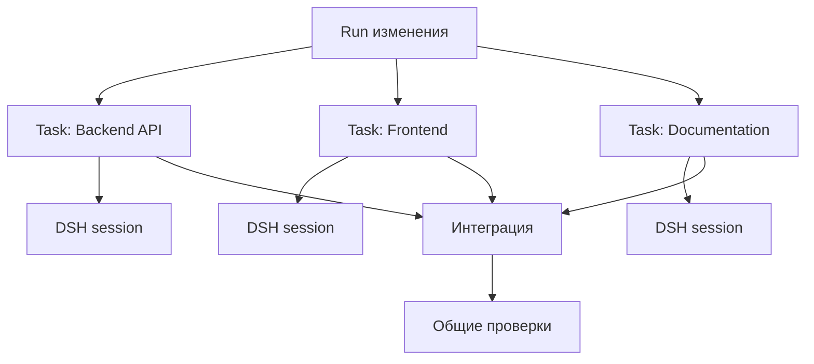
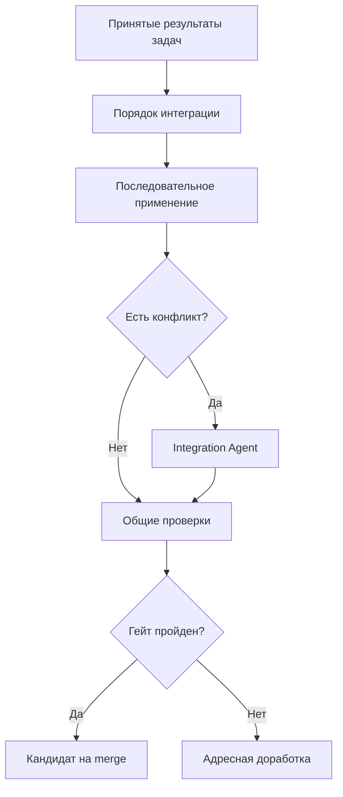
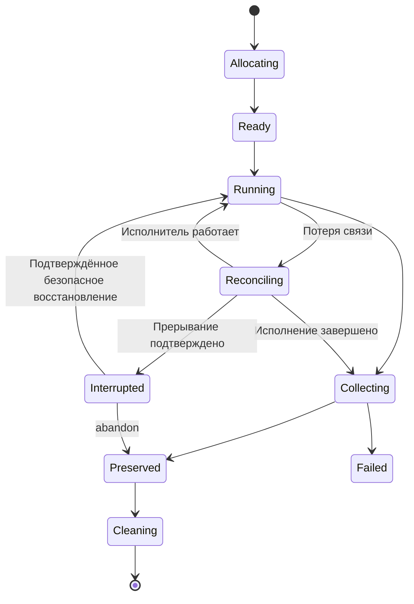

> **Снимок Notion от 2026-09-22**: [«Рабочие окружения и параллельное выполнение»](https://www.notion.so/3e2db33037c8804b9cc1e57ad43eb25b) · не редактируется; канон архитектуры в репо — `docs/hld.md` и `docs/adr/`. Оригинал: Notion «Архитектура v4».

## Этот слой отвечает за физическое место, где агент читает репозиторий, изменяет файлы, запускает команды и формирует результат.

Главный принцип:

> Dark Factory создаёт и контролирует рабочее окружение, а DSH получает его во временное пользование для выполнения конкретной попытки.

DSH не должен самостоятельно выбирать общий каталог продукта, создавать произвольные ветки или решать, когда изменения можно объединять.

### 5.1. Единица изоляции — Attempt Workspace

Для каждой изменяющей код Attempt фабрика создаёт отдельный worktree или checkout от закреплённого снимка. Для чтения достаточно неизменяемого снимка и отдельного каталога отчётов; сборка и тесты получают отдельный writable-каталог. Новая ветка для каждого чтения или гейта не требуется.

Структура окружения изменяющей код попытки:

```text
workspace/
  source/          # Git worktree или checkout
  context/         # подготовленный контекст задания
  output/          # структурированный результат
  artifacts/       # отчёты, скриншоты, логи
  temp/            # временные файлы
  manifest.yaml    # описание окружения
```

Окружение связано с конкретными:

- `change_id`;
- `run_id`;
- `stage_id`;
- `task_id`, если этап разбит на задачи;
- `attempt_id`;
- исходным Git commit;
- версией спецификации;
- профилем инструментов;
- сессией DSH.

Например:

```yaml
workspace:
  id: ws-01JXYZ
  run_id: run-128
  stage_id: implement
  stage_run_id: stage-run-128-implement-2
  attempt_id: attempt-128-implement-2

source:
  repository: product-api
  base_revision: 4e21ab7
  branch: factory/change-42/implement/attempt-2
  path: ./source

execution:
  mode: worktree
  harness: dsh
  profile: developer
  network: restricted
  timeout: 45m

limits:
  cpu: 4
  memory: 8Gi
  processes: 30
```

`manifest.yaml` — снимок конфигурации конкретной попытки, а не источник текущего состояния процесса.

---

### 5.2. Уровни изоляции

Нужно разделять три разных задачи.

#### Изоляция файлов

Решается через отдельный Git worktree или checkout. Два агента не изменяют один каталог одновременно.

Это минимальный обязательный уровень для разработки кода.

#### Изоляция процессов

Нужна, чтобы один агент:

- не завершил процессы другого;
- не занял его порты;
- не изменил общие зависимости;
- не повредил локальные сервисы;
- не получил доступ к лишним каталогам.

Соглашения, уникальные порты и отдельные каталоги обеспечивают координацию, но не изоляцию процессов или прав. Процесс с теми же правами пользователя может обращаться к чужим файлам и процессам. Ограничения обеспечиваются runtime и проверяются по capabilities; контейнерный профиль требует настройки mounts, сети, пользователя и секретов.

Поля network, cpu, memory, writablePaths и deniedPaths — требования профиля. Адаптер не объявляет их обеспеченными без реального механизма. Если обязательное ограничение не поддерживается, запуск отклоняется.

#### Изоляция безопасности

Контролирует:

- доступ к сети;
- секреты;
- допустимые команды;
- writable-каталоги;
- доступ к Docker socket;
- доступ к production-системам.

Git worktree этой изоляции не даёт.

### Рекомендуемые режимы

| Режим | Применение |
|---|---|
| `worktree` | Спецификации, планирование, обычная разработка и локальные тесты |
| `container` | Недоверенный код, установка зависимостей, миграции, потенциально опасные команды |
| `remote-runner` | Тяжёлые сборки, интеграционные тесты, GPU и специальные среды |
| `read-only` | Анализ, ревью, исследование архитектуры без изменения репозитория |

Для MVP достаточно `worktree` и опционального `container`.

---

## 5.3. Два уровня параллелизма

В системе могут существовать два независимых уровня параллельной работы.

### Параллелизм Dark Factory

В MVP фабрика планирует заранее заданные этапы, например тесты и ревью одного снимка. Реализация получает ограниченную группу задач из `tasks.md` как входной артефакт. Автоматическое построение отдельного DAG задач из `tasks.md` отложено.

После MVP модель может быть расширена для независимой разработки частей продукта:

- backend и frontend;
- несколько независимых сервисов;
- документацию и реализацию;
- security review и architecture review;
- тестирование разных компонентов.

Этот уровень виден пользователю и отражается в состоянии Run.

### Внутренний параллелизм DSH

DSH может использовать подагентов или параллельные инструменты внутри одного задания.

Например, Developer-агент может поручить подагентам:

- изучить API;
- найти связанные тесты;
- проанализировать схему БД.

Эти подагенты не становятся отдельными этапами Dark Factory.



Важно ограничивать произведение этих двух уровней. Если фабрика запустила пять задач, а каждая DSH-сессия создала пять подагентов, фактически работают уже 25 исполнителей.

Поэтому фабрика передаёт DSH доступный бюджет:

```yaml
parallelism:
  max_stage_attempts: 3
  max_harness_workers_per_attempt: 2
  max_total_model_sessions: 6
```

---

## 5.4. Что разрешено выполнять параллельно

Параллелизм должен следовать зависимостям, а не только наличию свободных ресурсов.

### Обычно можно запускать параллельно

- независимые исследования;
- формирование нескольких вариантов решения;
- реализацию разных сервисов;
- backend и frontend при зафиксированном контракте;
- независимые тестовые наборы;
- архитектурный и security review;
- создание документации и примеров.

### Требует предварительной фиксации контракта

- backend и frontend одной функции;
- producer и consumer события;
- сервис и SDK;
- схема БД и использующий её код;
- компонент UIKit и экран продукта.

Перед распараллеливанием необходимо создать общий контракт: OpenAPI, AsyncAPI, JSON Schema, SQL migration contract или TypeScript-интерфейсы.

### Лучше выполнять последовательно

- изменение одного и того же файла;
- последовательные миграции БД;
- крупный рефакторинг общей платформы;
- обновление базовых зависимостей;
- интеграцию нескольких веток;
- обновление canonical baseline;
- deployment в общее окружение.

---

## 5.5. Декомпозиция перед запуском

В MVP зависимости задаются между этапами Process через needs. Spec Kit tasks подготавливает `tasks.md`; ядро не превращает каждый пункт в отдельное исполнение.

Фиксированные независимые этапы объявляются в том же Process с явными входами, outputs и scope. Второй язык task-DAG и второй планировщик не вводятся.

После MVP динамическая декомпозиция потребует отдельного контракта задачи и проверки зависимостей. Агент не может самовольно создавать исполняемый граф.

Общие контракты фиксируются как read-only входы: backend читает contracts/orders.openapi.yaml и меняет services/orders/**, frontend читает тот же контракт и меняет apps/web/**. Если оба должны менять контракт, работы сериализуются или контракт выделяется в предшествующий этап.

scope помогает выявлять пересечения и неожиданный diff; сам по себе он не является песочницей.

---

## 5.6. Работа с Git

Каждая параллельная задача получает:

- одинаковый или явно определённый `base_revision`;
- отдельный worktree;
- отдельную ветку;
- собственные commits;
- собственный diff.

Пример:

```text
main
factory/change-42/integration
factory/change-42/backend/attempt-1
factory/change-42/frontend/attempt-1
factory/change-42/docs/attempt-1
```

Передача результата от DSH фабрике не равна merge. Агент только возвращает:

- изменённые файлы;
- commits или patch;
- выполненные проверки;
- структурированный итог;
- обнаруженные риски;
- признаки выхода за назначенный scope.

Фабрика проверяет результат и только затем допускает его к интеграции.

---

## 5.7. Интеграция параллельных изменений

Интеграция должна быть отдельным управляемым шагом.

Рекомендуемая последовательность:

1. Зафиксировать результаты всех задач.
2. Проверить каждую ветку отдельно.
3. Определить порядок объединения.
4. Последовательно применить изменения к integration branch.
5. После каждого применения выполнить быстрые проверки.
6. После полного объединения запустить общий набор тестов.
7. Передать конфликты специальной задаче интеграции.
8. Зафиксировать итоговый commit.



Конфликт нельзя автоматически считать обычной технической ошибкой. Он может означать, что две задачи реализовали несовместимые решения.

Integration Agent получает:

- обе версии изменений;
- исходную спецификацию;
- архитектурные ограничения;
- контракты;
- отчёты исполнителей;
- результаты тестов.

После разрешения конфликта все затронутые проверки считаются устаревшими и запускаются заново.

---

## 5.8. Планировщик и лимиты ресурсов

В локальной фабрике не нужен отдельный Kubernetes scheduler. Достаточно небольшого планировщика внутри TypeScript-ядра.

В MVP он учитывает зависимости этапов Process и простые лимиты. Динамические приоритеты и автоматическая оценка ресурсов относятся к расширению после MVP.

Целевая модель учитывает:

- зависимости этапов;
- доступные CPU и память;
- лимит DSH-сессий;
- лимиты модели и API;
- exclusivity отдельных ресурсов;
- приоритет задачи;
- доступность необходимых инструментов;
- политику параллелизма продукта.

Пример:

```yaml
scheduler:
  max_active_attempts: 3
  max_heavy_attempts: 1
  max_attempts_per_repository: 2

resources:
  - name: local-postgres
    capacity: 1
  - name: browser
    capacity: 2
  - name: integration-environment
    capacity: 1
```

Для MacBook с 24 GB RAM разумный старт:

- до трёх лёгких DSH-сессий;
- одна тяжёлая сборка или интеграционный стенд;
- не более одного локального контейнерного окружения с полной инфраструктурой;
- динамическое снижение параллелизма при дефиците памяти.

---

## 5.9. Leases вместо сложной распределённой блокировки

В MVP владелец ядра защищён локальной блокировкой, а процессы и попытки учитываются в SQLite. Для последующего расширения с несколькими исполнителями назначение может фиксироваться lease-записью:

```yaml
lease:
  attempt_id: attempt-104
  owner: local-worker-01
  acquired_at: 2026-09-21T15:10:00Z
  expires_at: 2026-09-21T15:15:00Z
  heartbeat_interval: 30s
```

Исполнитель периодически продлевает lease.

Если heartbeat пропал:

1. фиксируется reconciling и запрещается конкурентный повтор в том же окружении;
2. проверяются процесс, сессия и фактические результаты;
3. живое исполнение продолжает наблюдаться, завершённое — собирается;
4. interrupted фиксируется только после подтверждения прерывания;
5. при неизвестном исходе сохраняется blocked; новая Attempt разрешается после сверки и исключения конкурентного автора.

Истечение lease не доказывает остановку процесса. Запоздавший результат проверяется по attemptId и stageRunId и не заменяет текущую generation. Для локального MVP достаточно одного владельца ядра, блокировки записи и учёта процессов; распределённые leases не требуются.

Нельзя просто повторно выполнить задачу, если предыдущая попытка могла успеть произвести внешнее действие: создать MR, отправить комментарий или запустить deployment. Такие операции должны иметь idempotency key.

---

## 5.10. Жизненный цикл Workspace



Основные состояния:

- `allocating` — создаётся каталог, worktree и контекст;
- `ready` — окружение готово;
- `running` — DSH или детерминированная команда работает;
- `collecting` — фабрика собирает diff, логи и результаты;
- `reconciling` — исход исполнения сверяется; окружение не переиспользуется и не удаляется;
- `interrupted` — прерывание подтверждено, окружение сохранено;
- `preserved` — результат зафиксирован и доступен для анализа;
- `cleaning` — временные ресурсы удаляются.

Неуспешные окружения нельзя удалять немедленно. Они нужны для диагностики и продолжения работы.

Политика хранения может выглядеть так:

```yaml
retention:
  successful_workspace: 24h
  failed_workspace: 7d
  diagnostic_artifacts: 30d
  accepted_evidence: release-retention-policy
  accepted_commits: permanent
```

---

## 5.11. Секреты и внешние сервисы

Секреты не копируются в `context/` и не сохраняются в журналах DSH.

Фабрика выдаёт попытке краткоживущие полномочия:

- только для необходимых репозиториев;
- только для указанного окружения;
- с минимальными правами;
- на ограниченное время;
- без доступа к production по умолчанию.

Для локального MVP допустима интеграция с системным keychain или переменными окружения, но DSH должен получать только разрешённое подмножество.

Доступ к общим сервисам также контролируется ресурсными блокировками. Например, две задачи не должны одновременно применять миграции к одной тестовой БД.

---

## 5.12. Контракт с DSH

Канонический контракт находится в [«Контракт с DSH»](04-dsh-contract.md). Отдельные ExecutionRequest и ExecutionResult в этом слое не определяются.

WorkspaceManager материализует workspace.root, baseSnapshot, входные ArtifactRef и политику для HarnessRequest. Идентификация включает runId, stageId, stageRunId и attemptId.

DSH получает разрешённое подмножество environment. Адаптер проверяет фактическую поддержку ограничений, вычисляет diff независимо от отчёта агента и формирует HarnessResult после подтверждённого завершения.

Вопрос в живой сессии означает waiting_input. При потере связи сначала выполняется сверка.

---

## 5.13. Восстановление и повторное выполнение

После перезапуска фабрика читает SQLite и сверяет:

- активные leases;
- существование worktree;
- состояние процесса DSH;
- Git revision;
- наличие обязательных артефактов;
- незавершённые внешние операции.

Возможны три действия:

- `resume` — восстановить наблюдение, а при подтверждённой поддержке и безопасном состоянии продолжить существующую DSH-сессию;
- `retry` — создать новую Attempt в новом workspace;
- `reconcile` — проверить, не было ли действие фактически выполнено до сбоя.

Повторная попытка не должна использовать загрязнённый рабочий каталог предыдущей попытки. Если предыдущие изменения нужны, они передаются явно как commit, patch или входной артефакт.

---

## 5.14. Что реализовать в MVP

1. Worktree на изменяющую код Attempt и отдельные каталоги проверки.
2. Одну integration-ветку Change и ветки изменяющих код попыток.
3. Планирование этапов Process по needs; `tasks.md` остаётся артефактом.
4. Глобальный лимит DSH-сессий и блокировки общих ресурсов.
5. SQLite-записи Workspace, Attempt и владельца исполнения.
6. Сбор фактического diff, commits, логов и результатов проверок.
7. Проверку итогового интеграционного снимка.
8. Сохранение неуспешных окружений.
9. Отмену и сверку после перезапуска.

После MVP: динамический DAG задач, автоматическое распараллеливание реализации, распределённые workers/leases, Kubernetes Jobs, сложное разрешение конфликтов и перенос задачи между машинами.

Разделы об интеграции параллельных веток описывают целевое расширение; автоматическая параллельная разработка не обязательна для первой версии.

## Итоговая граница ответственности

**Dark Factory:**

- исполняет граф зависимостей этапов Process;
- определяет допустимый параллелизм;
- создаёт workspace и ветку;
- выдаёт ресурсы и полномочия;
- запускает и останавливает DSH;
- собирает фактический результат;
- интегрирует изменения;
- очищает окружение.

**DSH:**

- выполняет одно ограниченное задание;
- управляет внутренним агентным циклом;
- использует разрешённые инструменты;
- изменяет файлы внутри workspace;
- возвращает структурированный результат.

**Git:**

- фиксирует версии исходников и результатов;
- обеспечивает ветвление и перенос изменений;
- не является планировщиком или оперативным state store.

Таким образом, параллельное выполнение остаётся управляемым: агенты могут работать одновременно, но **объединение результатов, изменение baseline и переход процесса дальше всегда контролируются фабрикой**.
