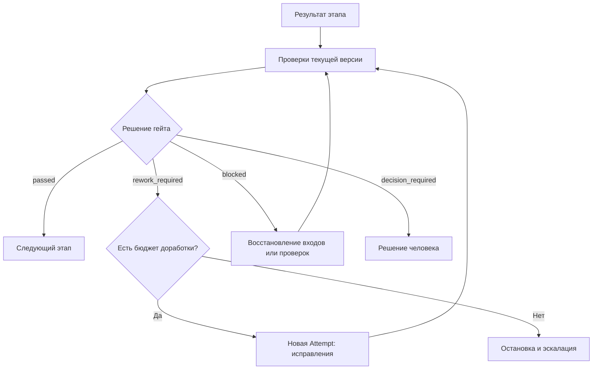

> **Снимок Notion от 2026-09-22**: [«Проверки, гейты и цикл доработки»](https://www.notion.so/3e2db33037c8801aa69eed1a8fd29523) · не редактируется; канон архитектуры в репо — `docs/hld.md` и `docs/adr/`. Оригинал: Notion «Архитектура v4».

## Этот слой определяет, **можно ли принять результат этапа, продолжить процесс или требуется доработка**.

Основное разделение:

> Проверка собирает доказательства. Гейт применяет правила принятия. Цикл доработки устраняет выявленные проблемы.

Ни DSH, ни отдельный Reviewer-агент не должны единолично переводить изменение в состояние «принято». Это решение принимает детерминированное ядро Dark Factory по декларативной политике.

Ниже — предлагаемый дизайн фабрики, а не описание готовых функций DSH или Spec Kit.

### 6.1. Три разных понятия

| Понятие | Что делает | Пример |
|---|---|---|
| **Check — проверка** | Исследует результат и сохраняет доказательства | Запуск тестов, проверка структуры спецификации, архитектурное ревью |
| **Finding — замечание** | Описывает конкретную проблему | Не определено поведение при повторной оплате |
| **Gate — гейт** | Определяет допустимость перехода | Продолжить, вернуть на доработку, запросить решение человека |

Например, тесты могут завершиться успешно, но гейт реализации останется закрыт: отсутствует обязательный тест для одного из критериев приёмки.

И наоборот: предупреждение о стиле кода необязательно должно блокировать процесс.

**Успешный запуск инструмента, отсутствие замечаний и принятие этапа — разные события.**

### 6.2. Что проверяется на разных этапах

Проверки нужны по всему жизненному циклу, а не только после реализации.

| Этап | Предмет проверки | Условие продолжения |
|---|---|---|
| Specification | Полнота требований, критерии приёмки, открытые вопросы | Нет блокирующих неопределённостей |
| Technical design | Контракты, ограничения, влияние на данные и архитектуру | Решение согласовано с обязательными правилами |
| Tasks | Покрытие требований задачами, зависимости, проверяемость | Существует исполнимый план |
| Implementation | Код, тесты, безопасность, соответствие требованиям | Обязательные проверки успешны |
| Integration | Совместимость объединённых изменений | Проверен итоговый интеграционный commit |
| Release | Готовность артефакта, миграций и восстановления | Выполнена политика выпуска |
| Post-deployment | Работоспособность развёрнутой версии | Пройдены smoke-проверки и предусмотренные наблюдения |

Это **каталог возможных гейтов**, а не требование включать их все в каждый процесс. Исследование интерфейса и исправление небольшой ошибки используют разные наборы.

### 6.3. Три вида проверок

#### Детерминированные

Обычные программы, не требующие агента:

- валидация YAML frontmatter и обязательных разделов;
- проверка ссылок на требования и артефакты;
- компиляция и проверка типов;
- линтеры и тесты;
- проверка API-контрактов;
- поиск секретов и известных уязвимостей;
- проверка допустимого состава изменений.

Их фабрика запускает напрямую через исполнитель команд.

#### Агентные

Используются там, где требуется интерпретация:

- противоречат ли требования друг другу;
- соответствует ли реализация бизнес-смыслу;
- нарушены ли архитектурные ограничения;
- какие негативные сценарии пропущены;
- соответствует ли интерфейс согласованной UX-спецификации.

DSH получает отдельное задание на ревью и возвращает структурированные замечания с доказательствами.

**Агентное ревью дополняет инструментальные проверки, но не заменяет их.** Даже независимая сессия может повторять ошибки автора, особенно при использовании той же модели.

#### Человеческие решения

Нужны, когда это прямо предусмотрено политикой:

- существенное изменение требований;
- исключение из архитектурного правила;
- принятие остаточного риска;
- необратимое изменение данных;
- действие за пределами предоставленных полномочий.

Человек не обязан подтверждать каждый этап. Для автономной работы важно заранее определить, какие решения фабрика вправе принимать сама.

### 6.4. Доказательства привязаны к версии результата

Запись «тесты прошли» недостаточна. Нужно знать, **что именно проверялось и в каких условиях**.

Предлагаемая структура результата проверки:

```yaml
check_id: integration-tests
execution_id: check-exec-381
attempt_id: attempt-104

subject:
  repository: product-api
  commit: 9b63d1a
  spec_digest: sha256:...
  contracts_digest: sha256:...

check_definition:
  version: "3"
  command: pnpm test:integration

environment:
  profile_digest: sha256:...
  dependency_lock_digest: sha256:...

status: passed

evidence:
  - artifacts/check-exec-381/junit.xml
  - artifacts/check-exec-381/output.log
```

Для документов вместо commit можно использовать хеш набора входных файлов.

Правила:

- код изменился — связанные проверки устарели;
- критерии приёмки изменились — оценку соответствия нужно повторить;
- изменились правила гейта — решение гейта нужно пересчитать;
- после интеграции веток проверяется итоговая версия, а не только исходные ветки.

Для MVP проще **повторять обязательные проверки после каждого изменения кода**, чем сразу реализовывать сложный анализ влияния. Выборочное повторное выполнение можно добавить позже.

### 6.5. Декларативное описание гейта

Эта страница определяет каноническую схему Gate v1. Политика содержит apiVersion, kind, metadata и checks; переходы и лимиты доработки задаются в Process.

```yaml
apiVersion: factory/v1
kind: Gate
metadata:
  id: implementation-accepted
  version: 1
checks:
  - type: execution-succeeded
    input: tests
  - type: schema-valid
    input: review
    schema: schemas/review.json
  - type: field-equals
    input: review
    field: verdict
    value: approved
  - type: same-subject
    inputs: [tests, review]
    subject: candidate
  - type: no-open-findings
    inputs: [tests, review]
    severity: [critical, high]
    status: [open, disputed, addressed]
```

Типы checks: artifact-exists, schema-valid, execution-succeeded, field-equals, same-subject, no-open-findings, human-decision. Каждый тип имеет проверяемую схему аргументов. Неизвестный тип или поле отклоняется до запуска. Свободные выражения и скрипты в Gate не допускаются.

CheckRunner формирует нормализованные результаты passed, failed, blocked. failed означает установленное несоответствие результата; blocked — отсутствие доказательства, ошибку инструмента или среды. Ненулевой exit code сохраняется как факт; адаптер проверки классифицирует причину, а при недостатке данных возвращает blocked. field-equals применяется только после валидации схемы.

GateEvaluator проверяет наличие и актуальность доказательств, обязательные результаты, открытые findings и решение человека. addressed не равно закрытому замечанию: его закрывает повторная проверка. same-subject сверяет снимок кода и закреплённые хеши спецификации и контрактов.

Отсутствующий, повреждённый или устаревший обязательный отчёт даёт blocked. При одновременных причинах приоритет: blocked, затем decision_required, затем rework_required, затем passed. Все причины сохраняются. Инфраструктурная проблема не порождает автоматическую доработку кода.

Ядро применяет transitions процесса и проверяет бюджеты. GateEvaluator не запускает этапы и не обнуляет счётчики.

### 6.6. Результат гейта — не только «да» или «нет»

Используются ровно четыре исхода. Контракт результата:

```typescript
interface GateResult {
  gateId: string;
  stageRunId: string;
  policyDigest: string;
  subjectDigest: string;
  evaluatedAt: string;
  outcome: "passed" | "rework_required" | "blocked" | "decision_required";
  reasons: Array<{ code: string; message: string; evidenceRefs: string[] }>;
  findingIds: string[];
  decisionId?: string;
}
```

GateResult сохраняется неизменно. Решение человека фиксирует личность/полномочия, время, точные версии артефактов и политики. Отказ в обязательном согласовании обрабатывается ядром по политике процесса; он не превращается в passed. Исчерпание лимита переводит этап в failed решением ядра.

| Исход | Значение | Следующее действие |
|---|---|---|
| `passed` | Все обязательные условия выполнены | Продолжить |
| `rework_required` | Есть конкретные устранимые дефекты | Создать задание на доработку |
| `blocked` | Не хватает доказательств или недоступна проверка | Восстановить проверку, входы или зависимость |
| `decision_required` | Нужно решение за пределами полномочий фабрики | Запросить человека |

Например:

- не прошёл тест расчёта скидки → `rework_required`;
- недоступна тестовая БД → `blocked`;
- требования допускают два несовместимых варианта → `decision_required`;
- все условия соблюдены → `passed`.

Так фабрика не будет поручать Developer-агенту «исправлять код», когда на самом деле сломано тестовое окружение.

### 6.7. Замечание — самостоятельный структурированный объект

Одного текстового отчёта ревью недостаточно для управляемой доработки.

```yaml
id: finding-42
source: acceptance-review
requirement: AC-07

category: correctness
severity: high
status: open

title: Повторный запрос создаёт второй заказ

location:
  file: services/orders/create.ts
  symbol: createOrder

evidence:
  - artifacts/review-17/duplicate-order-reproduction.md

expected: Повторный запрос с тем же ключом возвращает исходный заказ
actual: Создаётся новый заказ

verification:
  kind: regression-test
  description: Два запроса с одинаковым ключом создают один заказ
```

У замечания должны быть:

- стабильный идентификатор;
- связь с требованием или правилом;
- обоснование и проверяемые доказательства;
- ожидаемый результат исправления;
- способ повторной проверки.

Предложения «можно сделать красивее» нужно отделять от дефектов. Новые пожелания не должны незаметно расширять scope текущего изменения.

Developer может отметить замечание как `addressed`, но закрывает его проверка или уполномоченный ревьюер. `Disputed` означает необходимость разбора, а не разрешение игнорировать проблему.

### 6.8. Цикл доработки



Задание на доработку содержит:

- точную версию исправляемого результата;
- список замечаний;
- требования, которые необходимо сохранить;
- разрешённую область изменений;
- команды и критерии повторной проверки;
- ограничения времени и стоимости.

**Доработка — новая Attempt, а не перезапись истории предыдущей.** При изменении набора входов, включая feedback, создаётся новая generation StageRun. Workspace изменяющей код попытки создаётся от явно выбранного commit с предыдущим результатом. Старое принятие остаётся фактом для прежних входов и не применяется к новой generation.

Если причина обнаружена выше по процессу, исправляется соответствующий этап:

- ошибка кода → реализация;
- несовместимый контракт → техническое решение;
- противоречивое требование → спецификация.

Изменение исходных требований делает зависимые результаты устаревшими. Фабрика пересчитывает необходимые этапы, а не просит разработчика угадывать новый смысл.

### 6.9. Как избежать бесконечного цикла

Ядро учитывает max_cycles как число дополнительных циклов после первой реализации; смена StageRun не сбрасывает бюджет Run. Для MVP обязательны число циклов и общее время. Дополнительные ограничения включаются только при наличии соответствующих измерений:

```yaml
rework:
  max_cycles: 3
  max_elapsed: 90m
  max_cost_usd: 15
  max_same_finding_repeats: 2
  stop_on_no_progress: true

check_retry:
  max_infrastructure_retries: 2
```

Это пример политики, а не универсальные значения.

Важно отдельно учитывать:

- **повтор проверки** после инфраструктурного сбоя;
- **доработку результата** после обнаружения дефекта;
- **пересмотр спецификации** после изменения требований.

Признаки отсутствия прогресса: повторяется та же воспроизводимая ошибка, исправления попеременно ломают один сценарий или возникают прежние блокирующие замечания.

После исчерпания бюджета фабрика сохраняет результат, объясняет причину остановки и предлагает конкретное решение. Она не снижает требования автоматически ради зелёного статуса.

### 6.10. Независимость проверки и защита правил

Для агентного ревью предлагаю отдельную DSH-сессию:

- собственная роль Reviewer;
- доступ к спецификации, diff и необходимому контексту;
- исходники в режиме read-only;
- запись отчёта в отдельный каталог;
- отсутствие прав на merge, deployment и изменение политики гейта.

Проверка кода при этом может требовать writable-песочницы для сборки и запуска тестов. Это отдельное окружение, а не повод выдавать ревьюеру права на изменение проверяемого результата.

Критический принцип:

> Проверяемое изменение не должно само определять, по каким правилам его принимать.

Версии обязательных политик и команд проверки фиксируются из доверенной конфигурации. Изменения этих правил внутри задачи рассматриваются отдельно. Правка тестов допустима, но удаление обязательной проверки или ослабление критерия не должно автоматически открывать гейт.

Для доработки самой фабрики это особенно важно: новый код гейта не может быть единственным доказательством собственной корректности.

### 6.11. Локальные проверки и CI/CD

В твоей модели основные проверки можно выполнять локально или на выделенном исполнителе без запуска полного GitLab pipeline на каждую итерацию:

1. Агент создаёт результат.
2. Фабрика запускает проверки.
3. Выполняется ограниченный цикл доработки.
4. Проверяется интеграционный commit.
5. Фиксируется решение гейта.
6. Через адаптер запускается доставка разрешённой версии.

При этом **локальное решение гейта и доверие системы deployment — разные границы**. Для MVP на одной машине допустим локальный журнал. При командном и production-исполнении системе доставки нужны доверенные результаты проверок, привязанные к точному commit и артефакту сборки; одного редактируемого JSON с `passed` недостаточно.

### 6.12. Минимальная реализация

Для MVP достаточно четырёх небольших модулей в одном TypeScript-приложении:

| Модуль | Ответственность |
|---|---|
| `CheckRunner` | Запускает команды и агентные ревью, собирает результаты |
| `GateEvaluator` | Вычисляет решение по политике и доказательствам |
| `FindingStore` | Хранит замечания и историю их обработки |
| `ReworkController` | Подготавливает feedback для новой попытки; ядро выбирает переход и контролирует лимиты |

Хранение:

- YAML — определения проверок, гейтов и лимитов;
- Markdown — инструкции ревьюеров;
- SQLite — результаты, замечания и решения;
- файлы артефактов — логи, отчёты, скриншоты;
- Git — версии кода, спецификаций и политик.

Отдельный policy engine, сложная система оценки качества и отдельный сервис ревью для MVP не нужны.

**Итог: DSH создаёт и исправляет результат; инструменты и ревьюеры собирают доказательства; Dark Factory решает, достаточно ли этих доказательств для продолжения.** Автономность достигается заранее определёнными правилами и ограниченным циклом доработки, а не отсутствием проверок.
