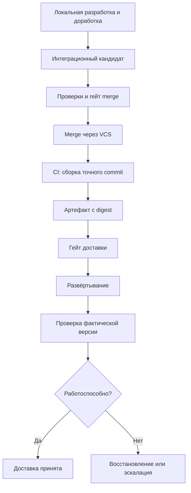

> **Снимок Notion от 2026-09-22**: [«Git/VCS и доставка через CI/CD»](https://www.notion.so/3e2db33037c88016b78cd4bee1f8b9d4) · не редактируется; канон архитектуры в репо — `docs/hld.md` и `docs/adr/`. Оригинал: Notion «Архитектура v4».

## **Dark Factory управляет изменением целиком, Git фиксирует версии, GitLab/GitHub обеспечивают совместную работу, а CI/CD выполняет сборку и доставку разрешённой версии.**

Для твоей архитектуры предлагаю сохранить принцип:

> Разработка, проверки и доработка выполняются локально или на исполнителях фабрики. CI/CD подключается для доставки, а не управляет каждым шагом AI SDLC.

При этом фабрика должна точно связывать: **какое изменение принято → какой commit проверен → какой артефакт собран → что фактически развёрнуто**.

Ниже — предлагаемый дизайн, а не описание готовых функций DSH.

### 7.1. Четыре границы интеграции

Не стоит объединять все операции в один «GitLab-адаптер».

| Компонент | Ответственность | Чего не делает |
|---|---|---|
| **Git adapter** | Локальные worktree, ветки, diff, commit, fetch, push, объединение изменений | Не управляет этапами AI SDLC |
| **VCS adapter** | MR/PR, обсуждения, статусы, сведения о защищённых ветках и merge | Не принимает архитектурные решения |
| **CI/CD adapter** | Запуск, наблюдение и отмена pipeline, получение артефактов | Не определяет общий процесс фабрики |
| **Deployment adapter** | Получение фактической версии и состояния окружения | Не считает успешный pipeline достаточным доказательством работоспособности |

Это модули одного приложения, а не четыре сервиса. В MVP CI/CD и Deployment могут иметь общую реализацию.

Так замена GitLab на GitHub не затронет создание worktree или логику гейтов.

### 7.2. Источники истины

Нужно явно разделить несколько разных состояний.

| Сведения | Источник истины |
|---|---|
| Содержимое версии кода | Git commit |
| Текущие незакоммиченные изменения | Рабочий каталог |
| Этап процесса, попытки, решения гейтов | SQLite фабрики |
| Факт создания и слияния MR/PR | VCS |
| Факт выполнения pipeline | CI/CD |
| Содержимое поставляемой сборки | Неизменяемый артефакт и его digest |
| Фактически запущенная версия | Целевое окружение |

Например, `pipeline: succeeded` ещё не означает `deployment: healthy`: pipeline мог только обновить deployment-манифест, а развёртывание ещё продолжается.

**Чтение исходников и спецификаций идёт из локальных файлов.** Git используется для фиксации, сравнения и синхронизации версий, а не как оперативная база процесса.

### 7.3. Ветки и commits

Для MVP предлагаю:

- одна интеграционная ветка на Change;
- отдельная ветка на каждую изменяющую код Attempt;
- одна основная MR/PR на Change;
- последовательное включение принятых результатов в integration-ветку.

В MVP `tasks.md` не порождает отдельный DAG задач. Примеры нескольких параллельных веток и их объединения описывают расширение после MVP; механизм проверки итогового commit обязателен уже для одной ветки.

Например:

```text
main
factory/change-42/integration
factory/change-42/task-api/attempt-1
factory/change-42/task-ui/attempt-1
factory/change-42/task-ui/attempt-2
```

Здесь все имена — отдельные refs. Не следует одновременно создавать ветку `factory/change-42` и ветки внутри `factory/change-42/...`: такое именование создаёт конфликт пространства Git refs.

Каждая Attempt стартует от явно выбранного commit. Повторная попытка может включать предыдущий результат, но только через зафиксированную версию, а не неявное наследование загрязнённого каталога.

**Не нужно отправлять в remote каждое промежуточное изменение.** Агент работает локально; фабрика создаёт checkpoints и выполняет push в предусмотренных точках: для резервирования, публикации результата или создания MR.

### 7.4. Кто имеет право выполнять Git-операции

Предлагаю следующую политику:

| Операция | Исполнитель |
|---|---|
| Читать файлы, diff и историю | DSH и фабрика |
| Изменять файлы в workspace | DSH |
| Создавать локальные commits | Фабрика; опционально DSH в пределах своей ветки |
| Создавать worktree и назначать ветки | Фабрика |
| Push и создание MR/PR | Фабрика через адаптеры |
| Merge в защищённую ветку | Фабрика через VCS после гейта |
| Запуск доставки | Фабрика через CI/CD-адаптер |

Для MVP проще поручить финальную фиксацию результата фабрике: после завершения агента она вычисляет фактический diff, проверяет scope и создаёт commit.

DSH не нужны токены для merge или production deployment. Инструкции «не выполняй push» недостаточно: ограничение должно поддерживаться доступными полномочиями и средой исполнения.

### 7.5. MR/PR — публикация изменения, а не оркестратор

MR связывает результат фабрики с привычным процессом команды.

В описании достаточно показывать:

- цель и границы изменения;
- ссылки на спецификацию и задачи;
- итоговый commit;
- сводку проверок и замечаний;
- решение гейта;
- миграции и риски;
- способ доставки и восстановления.

**MR не должен дублировать всю SQLite фабрики.** Подробная история остаётся в Run и его артефактах; в VCS публикуется понятная сводка.

Для автономного режима merge разрешается только когда:

1. принят актуальный результат;
2. проверки относятся к текущему commit;
3. выполнены правила защищённой ветки;
4. отсутствуют блокирующие замечания;
5. политика риска разрешает автоматический merge.

Если VCS требует обязательное человеческое подтверждение или CI-проверку, фабрика соблюдает это требование. Локальный гейт не отменяет защиту репозитория.

### 7.6. Изменение целевой ветки после проверки

Это важнейший случай для параллельной фабрики.

Допустим, Change проверен относительно `main@A`. Пока агент работал, другой Change обновил `main` до `B`. Успешные проверки первой ветки ещё не доказывают корректность её объединения с `B`.

Перед merge фабрика:

1. Получает актуальную целевую revision.
2. Формирует интеграционный кандидат относительно неё.
3. Повторяет необходимые проверки.
4. Пытается выполнить merge с защитой от изменения проверенных refs.
5. Если целевая ветка снова изменилась — повторяет процедуру.

Для MVP предлагаю **последовательную очередь интеграции на репозиторий**. Разработка остаётся параллельной, а принятие итоговых изменений — последовательным.

Такая очередь сериализует действия самой фабрики, но не исключает внешние merges. Поэтому всё равно нужны проверки актуальности и поддержка возможностей конкретного VCS. Если платформа не позволяет гарантировать проверку точного merge-кандидата, потребуется проверка итогового commit перед доставкой.

### 7.7. Как выглядит доставка



Здесь два разных решения:

- **Merge gate:** можно ли принять изменение в кодовую базу?
- **Delivery gate:** можно ли доставить этот артефакт в конкретное окружение?

Изменение может быть слито, но ещё не разрешено к production deployment. Статусы `merged`, `deployed` и `verified` не должны смешиваться.

### 7.8. Что оставить в CI/CD

С учётом твоего желания сократить задержки GitLab CI предлагаю разделение:

| В фабрике, до доставки | В доверенном контуре CI/CD |
|---|---|
| Агентная разработка и ревью | Сборка из точного commit |
| Линтеры, типизация, unit-тесты | Проверки собранного артефакта |
| Проверки спецификации и контрактов | Публикация в registry |
| Локальные интеграционные тесты | Доставка в целевое окружение |
| Цикл доработки | Операции с deployment-секретами |
| Решение о готовности изменения | Возврат доказательств доставки |

**Необязательно повторять весь локальный набор проверок в CI.** Но проверки, которые зависят от доверенной среды, итоговой сборки или правил production, должны выполняться в соответствующем контуре.

Если сборка тоже вынесена из CI, система доставки должна получать доверенный неизменяемый артефакт. Архив с ноутбука и текстовый статус `passed` сами по себе такой гарантии не дают.

Разработка и доставка могут быть разными Run внутри одного Change. Передача выполняется через неизменяемый манифест с revisions кода и baseline, хешами доказательств, gateDecisionId, версией политики и целевой средой; после сборки добавляется digest артефакта. Повтор доставки использует этот манифест без повторного запуска агентов разработки. Перед внешним действием адаптер снова проверяет актуальность разрешения и состояние цели.

### 7.9. Единица доставки — артефакт, а не имя ветки

Запуск вида «задеплой текущий `main`» неоднозначен: ветка может измениться между решением и выполнением.

Предлагаемый запрос:

```yaml
delivery:
  id: delivery-42
  change_id: change-42
  run_id: run-128

  source:
    repository: product-api
    commit: 9b63d1a...

  target:
    environment: staging

  authorization:
    gate_decision_id: gate-913
    policy_version: "4"

  idempotency_key: delivery-42-staging
```

После сборки к записи добавляется конкретный артефакт:

```yaml
artifact:
  reference: registry.example/product-api
  digest: sha256:...

verification:
  source_commit: 9b63d1a...
  build_execution_id: build-271
```

Один и тот же артефакт можно продвигать между окружениями без пересборки, если приложение поддерживает внешнюю конфигурацию окружения. Если staging и production требуют разных сборок, каждую нужно учитывать и проверять отдельно.

### 7.10. Асинхронность, повторы и восстановление

Запуск pipeline и его завершение — разные операции.

Адаптер должен поддерживать минимальный контракт:

```typescript
interface DeliveryAdapter {
  start(request: DeliveryRequest): Promise<DeliveryReference>;
  observe(reference: DeliveryReference): Promise<DeliveryStatus>;
  cancel(reference: DeliveryReference): Promise<CancelResult>;
}
```

При этом `cancel` означает запрос отмены, **не гарантированный откат уже выполненных действий**.

Опасный сценарий: CI принял запрос, но фабрика не получила ответ из-за сбоя сети. Слепой повтор может запустить второй deployment.

Поэтому фабрика:

- сохраняет намерение до отправки;
- передаёт correlation/idempotency key, где это поддерживается;
- сохраняет внешний execution ID;
- после сбоя сначала сверяет состояние внешней системы;
- при неразрешимой неоднозначности блокирует повтор и запрашивает решение.

Собственный ключ в SQLite не создаёт exactly-once семантику в API провайдера. Адаптер должен явно учитывать его реальные возможности.

### 7.11. Окружения, миграции и восстановление

Разработка может идти параллельно, но изменение одного окружения требует координации.

Для MVP:

- не более одной активной доставки в конкретное окружение продукта;
- миграции выполняет один назначенный исполнитель;
- deployment фиксирует предыдущую и новую версии;
- после запуска проверяется фактическая версия и здоровье сервиса.

Блокировка в SQLite координирует только фабрику. Если окружение меняют другие системы или люди, координация должна существовать и в контуре доставки.

**Откат приложения не равен откату данных.** Для миграций политика должна заранее определять совместимость версий и допустимый способ восстановления. Автоматически можно возвращать предыдущий артефакт только там, где это безопасно; в остальных случаях нужны исправление вперёд или решение человека.

При GitOps CI обновляет желаемую версию в GitOps-репозитории, а Deployment adapter наблюдает за фактической синхронизацией и состоянием приложения. Успешный commit в GitOps-репозиторий — ещё не завершённая доставка.

### 7.12. Если код и baseline находятся в разных репозиториях

Обычный Git не обеспечивает одну атомарную операцию merge сразу для нескольких репозиториев.

Поэтому Release/Change должен фиксировать набор связанных revisions:

```yaml
revisions:
  application: 9b63d1a...
  knowledge: 28e730c...
  gitops: 74bc915...
```

Если код принят, а обновление baseline не завершилось, фабрика сохраняет промежуточный статус и продолжает согласование после восстановления.

Полезно различать:

- **принятый baseline** — соответствует принятой реализации;
- **развёрнутую версию** — фактически работает в конкретном окружении.

Не стоит менять смысл baseline в зависимости от того, успел ли production deployment.

### 7.13. Что реализовать в MVP

Достаточно:

1. Локального Git adapter.
2. Одного VCS adapter — для выбранной основной платформы.
3. Одной MR/PR на Change.
4. Последовательной интеграции на репозиторий.
5. Привязки гейтов к точным revisions.
6. Запуска и наблюдения за одним delivery pipeline.
7. Записи commit, artifact digest и целевого окружения.
8. Восстановления после неопределённого результата внешнего вызова.
9. Проверки фактически развёрнутой версии.
10. Раздельных полномочий агента, фабрики и CI/CD.

Не нужны собственный CI-сервер, универсальный язык pipeline или отдельная распределённая очередь доставки.

**Итоговая граница: фабрика решает, что разрешено принять и доставить; Git/VCS фиксируют и публикуют изменение; CI/CD исполняет доставку; целевое окружение подтверждает, что нужная версия действительно работает.**
