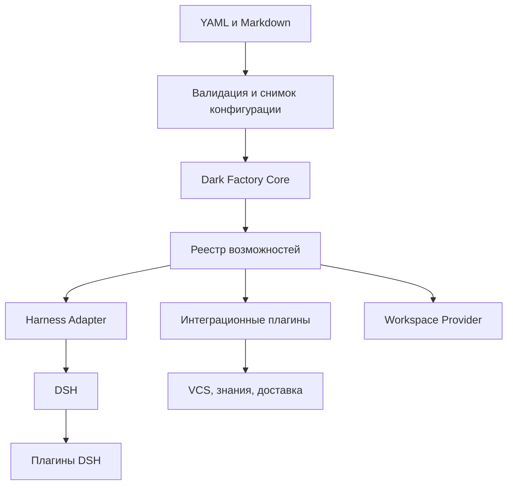

> **Снимок Notion от 2026-09-22**: [«Модульность, декларативность и плагинная архитектура фабрики»](https://www.notion.so/3e2db33037c8810999e0e845ae0fe07e) · не редактируется; канон архитектуры в репо — `docs/hld.md` и `docs/adr/`. Оригинал: Notion «Архитектура v4».

**Предлагаемое решение:** Dark Factory развивается как модульное TypeScript-приложение с небольшим устойчивым ядром, декларативными пакетами процессов и двумя независимыми уровнями плагинов: расширения фабрики и расширения DSH. Типовые изменения процесса выполняются через YAML и Markdown; новые технические возможности подключаются через версионируемые контракты.

**Статус:** архитектурное дополнение к v4. Описанные Plugin API, манифесты и структура каталогов — предложения для реализации, а не уже существующие функции. Канонические Process, Gate и Harness-контракты остаются в соответствующих страницах v4.

## 1. Три разных механизма изменения

| Механизм | Что меняем | Пример |
|---|---|---|
| Декларативная настройка | Композицию уже реализованных возможностей | Добавить UX-исследование, роль Security, гейт, инструкцию или лимит повторов |
| Плагин | Реализацию известного контракта расширения | Подключить другой harness, VCS, источник знаний или способ подготовки workspace |
| Изменение ядра | Семантику управления процессом и гарантии состояния | Ввести распределённое владение Run либо новый механизм инвалидации результатов |

Модуль — граница ответственности в коде. Плагин — модуль, подключаемый через публичный контракт и регистрацию. Отдельный репозиторий, сервис или процесс для каждого модуля не требуется.

**Цель — менять большинство возможностей без изменения ядра. Обещание «ядро никогда не меняется» нереалистично:** новый класс исполнения может потребовать новой версии контракта и контролируемого обновления ядра.

## 2. Устойчивое ядро и точки расширения

Ядро сохраняет единоличную ответственность за:

- Run, StageRun, Attempt, generation и историю решений.
- Планирование этапов и применение transitions.
- Проверку актуальности входов, выходов и доказательств.
- Транзакции состояния, владение локальной рабочей областью и восстановление.
- Ограничения повторов, доработок, параллелизма и полномочий.
- Применение GateResult и решение о принятии результата.

Плагины предоставляют возможности через порты. Они не изменяют таблицы ядра напрямую, не выставляют accepted и не запускают следующий этап самостоятельно. CLI и будущая Console используют одни и те же прикладные операции.



Зависимости направлены к контрактам фабрики. Core не импортирует SDK DSH, Cordis или GitLab. Конкретные реализации собираются в composition root — небольшом модуле запуска приложения.

Основание: [«Ядро Dark Factory»](02-core.md).

## 3. Два уровня плагинов

| Аспект | Плагин Dark Factory | Плагин DSH |
|---|---|---|
| Область ответственности | Интеграции и возможности процесса разработки | Возможности агентного исполнения внутри попытки |
| Типовые расширения | Harness, VCS, доставка, workspace, источники контекста | Инструменты агента, подготовка контекста, специфичное поведение сессии |
| Контракт | Публичные интерфейсы Dark Factory | Механизм расширений закреплённой версии DSH |
| Результат | Типизированный ответ, артефакты, статус внешней операции | Результат инструмента или агентной работы, нормализуемый адаптером |
| Право менять этап | Нет: решение принимает Core | Нет: DSH не владеет процессом фабрики |

Например, создание MR как управляемая операция доставки принадлежит VCS-плагину фабрики. Поиск файлов и редактирование кода внутри worktree принадлежат harness. Если агенту нужен инструмент «запросить публикацию», он обращается к контролируемой операции фабрики; это не прямой обход политик через токен VCS.

**Cordis не требуется переносить в ядро.** Для MVP достаточно явного реестра и dependency injection средствами TypeScript. Потребность в более сложном контейнере оценивается отдельно. Внутренние объекты DSH не пересекают HarnessAdapter.

Собственный DSH-плагин создаётся только при подтверждённом пробеле SDK, профиля или существующих инструментов. Контракт и ограничения интеграции: [«Контракт с DSH»](04-dsh-contract.md).

## 4. Какие расширения нужны фабрике

| Точка расширения | Назначение | Граница MVP |
|---|---|---|
| HarnessAdapter | Запуск, наблюдение, ввод ответа, отмена и получение результата | DSH; другой движок добавляется через тот же канонический контракт |
| VCS Provider | Публикация ветки, создание и сверка MR/PR | Один выбранный провайдер; локальный Git обслуживается отдельно |
| Delivery Provider | Запуск и наблюдение доставки | Один адаптер CI/CD с идентификатором внешней операции |
| Workspace Provider | Подготовка, изоляция, снимок и очистка рабочего окружения | Локальный worktree; контейнеры и удалённые окружения позднее |
| Instruction Provider | Подготовка инструкций и шаблонов | Локальные MD и отдельные процедуры Spec Kit |
| Context Provider | Получение и материализация версионированных входов | Локальные файлы; дополнительные источники по необходимости |
| Observer | Метрики, журналы, уведомления о сохранённых событиях | Не участвует в принятии результата |

Типы этапов остаются harness, command, integration и внутренний gate. Новый поставщик интеграции не означает новый тип этапа. Обычную проверку лучше выполнить через command и получить структурированный отчёт, чем создавать новый API плагинов.

**GateEvaluator и SQLite остаются внутренними модулями MVP.** Базовый набор предикатов гейтов встроен. Позднее можно открыть контракт чистого предиката: только проверка переданного доказательства без побочных действий и без самостоятельной маршрутизации. Плагин состояния и динамически подключаемые планировщики пока не нужны.

Spec Kit используется как поставщик отдельных процедур и шаблонов. Workflow Engine Spec Kit не подключается и второго владельца переходов не появляется.

## 5. Что выносится в декларативные пакеты

Process Pack содержит процессы, роли, инструкции, skills, гейты, политики, схемы результатов и шаблоны. Это версионируемый пакет данных; наличие файлов скриптов внутри skill не делает их безопасными или автоматически разрешёнными к исполнению.

| Изменение | Достаточно конфигурации? | Условие |
|---|---|---|
| Добавить роль IT-директора или архитектора | Да | Роль использует существующие профиль и инструменты |
| Запустить только исследование UX | Да | Отдельный Process с собственными входами, выходами и гейтом |
| Добавить Security Review перед доставкой | Да | Доступны исполнитель проверки и схема отчёта |
| Изменить порядок этапов или маршрут доработки | Да | Соблюдены семантика Process и ограниченность циклов |
| Подключить другой VCS | После реализации адаптера | Одна запись provider не создаёт интеграцию |
| Добавить неизвестный инструмент агенту | Не всегда | Нужен доступный инструмент либо плагин DSH |
| Распределить Run между несколькими управляющими узлами | Нет | Меняются гарантии владения, состояния и восстановления |

YAML описывает структуру и ссылки, MD — инструкции и знания, JSON Schema — машинно проверяемую форму результата. Mermaid отображает процесс; в v4 он не становится вторым исполняемым источником истины.

Не следует превращать YAML в язык произвольного программирования: никаких eval, импортов произвольного кода или неограниченных циклов. Сложный анализ выполняет агент или команда, а гейт проверяет структурированный результат.

Канонические примеры: [«Декларативный процесс»](03-declarative-process.md).

## 6. Минимальный Plugin API

Предлагается общий жизненный цикл пакета: проверка манифеста → регистрация возможностей → инициализация ресурсов → работа → освобождение ресурсов. Интерфейс каждой возможности специализированный; один универсальный execute для всех интеграций скрывает важные различия.

Манифест ниже иллюстрирует новый контракт расширений, не заменяя Process или HarnessRequest:

```yaml
apiVersion: factory.plugin/v1
id: small.vcs-gitlab
version: 0.4.0
entrypoint: ./dist/index.js
requires:
  factoryPluginApi: "1"
provides:
  - kind: vcs
    id: gitlab
configSchema: ./schemas/config.json
requestedPermissions:
  - vcs.read
  - vcs.push
  - vcs.create-change-request
```

Диапазоны совместимости допустимы в метаданных пакета, но релиз фиксирует точный пакет и его digest. Запрошенные разрешения — декларация потребности, а не выдача доступа.

При регистрации:

- Идентификаторы имеют namespace; дубликаты приводят к ошибке запуска, а не неявной подмене.
- Требуемые зависимости перечисляются явно; циклы и отсутствующие возможности выявляются до первого побочного действия.
- Выбор провайдера задан конфигурацией; тихая подмена движка или интеграции запрещена.
- Плагин получает только необходимые порты, контекст операции, сигнал отмены и разрешённые ресурсы.
- Результаты проходят проверку схемы и нормализацию ошибок.

Harness использует канонические HarnessRequest, HarnessResult и ExecutionSnapshot. Идентификаторы runId, stageId, stageRunId и attemptId сохраняются сквозным образом; параллельный общий ExecutionRequest не вводится.

## 7. Сборка конфигурации и воспроизводимость

До запуска фабрика разрешает ссылки и проверяет весь состав:

1. Выбирает установленный релиз и точные версии плагинов.
2. Загружает Process Pack, профиль продукта и допустимые локальные настройки.
3. Проверяет схемы, зависимости этапов, ссылки на роли, инструменты и выходы.
4. Проверяет существование всех providers и поддержку требуемых возможностей.
5. Вычисляет эффективные полномочия как пересечение ограничений установки, продукта и этапа; этап не может расширить полномочия.
6. Фиксирует неизменяемый снимок итоговой конфигурации и хеши входов.

Для не связанных с безопасностью настроек нужен документированный приоритет: defaults пакета → профиль продукта → разрешённые параметры запуска. Неизвестные поля и неоднозначные конфликты — ошибки. Секреты представлены ссылками и не включаются в сохраняемый снимок.

Run привязан к версии фабрики, набору плагинов, процессу, инструкциям и политике. Изменение файла на диске не меняет уже запущенный Run незаметно. Новая конфигурация применяется к новому Run; перенос незавершённого запуска требует явной проверки совместимости.

## 8. Надёжность и границы доверия

**TypeScript-интерфейс не является границей безопасности.** Плагин в процессе Node.js технически может обращаться к файловой системе и сети с правами процесса. Для MVP встроенные плагины считаются доверенными, проверяются и входят в релиз.

Недоверенные сторонние расширения требуют отдельного процесса или контейнера, ограниченных credentials и контролируемого протокола. Запись permissions в YAML сама по себе такую изоляцию не обеспечивает.

Для внешнего действия ядро сначала фиксирует намерение и стабильный ключ операции, затем вызывает плагин. Плагин возвращает внешний идентификатор и позволяет сверить результат. Неизвестный исход означает reconciliation или blocked; слепой повтор недопустим.

Observer получает уже сохранённые события. Его сбой не отменяет принятие результата; доставка уведомлений может быть повторной и требует дедупликации. Если действие обязательно для процесса, оно оформляется этапом integration, а не скрытым обработчиком события.

Плагины не получают произвольный доступ к SQLite Core. Собственное состояние расширения при необходимости размещается в выделенной области с версией формата и политикой checkpoint. Расширение не должно становиться вторым источником истины о статусе этапа.

## 9. Структура разработки и релизы

Предлагаемое уточнение структуры monorepo:

```text
packages/core/
packages/contracts/
packages/plugin-api/
packages/cli/
packages/dsh-adapter/
plugins/factory/
plugins/dsh/
processes/
roles/
instructions/
skills/
gates/
policies/
schemas/
tests/contracts/
releases/
```

В packages/contracts находятся канонические доменные контракты. plugin-api экспортирует разрешённую поверхность расширений и использует эти контракты, не копируя их. Core зависит от контрактов, реализации — от публичного API; модуль запуска собирает реализации.

Собственные плагины выпускаются вместе с Core и CLI под общей версией фабрики. Отдельный репозиторий нужен при независимом владельце или цикле выпуска, а не просто из-за слова «плагин».

Релиз фиксирует Core, CLI, фабричные плагины, DSH, SDK, плагины DSH, Process Pack и форматы состояния. Обновление выполняется установкой нового комплекта рядом со старым. Горячая замена плагинов в активном Run в MVP не нужна.

При откате возвращается согласованный комплект и совместимое состояние. Откат пакетов не отменяет уже созданный MR, отправленное уведомление или deployment; эти действия требуют сверки и отдельных компенсирующих операций.

Подробная политика: [«Разработка, версионирование и откат релизов фабрики на DSH»](11-releases.md).

## 10. Безопасное саморазвитие фабрики

Стабильная фабрика может разрабатывать новое расширение как обычное изменение:

1. Получить задачу и критерии приёмки.
2. Выбрать декларативный пакет, плагин фабрики или плагин DSH.
3. Подготовить изменение в отдельной ветке/worktree.
4. Проверить контракты, разрешения и сценарии восстановления.
5. Собрать кандидат релиза с точным составом.
6. Запустить кандидата с отдельным состоянием, профилем DSH и рабочими каталогами.
7. Продвинуть проверенный комплект согласно политике выпуска.

Работающий агент не устанавливает новый код в управляющий им процесс. Если расширение требует изменения инвариантов Core, это явно отмечается как изменение ядра и проходит отдельное архитектурное рассмотрение. Политика автоматического или ручного выпуска задаётся уровнем риска.

## 11. Последовательность реализации

**Первый шаг:** выделить contracts, устойчивое Core и composition root. Реализовать статическую регистрацию встроенных адаптеров. Публичный marketplace и динамическая загрузка произвольных пакетов не требуются.

**Второй шаг:** оформить Process Pack, схемы и проверку конфигурации. Добавление роли, инструкции и обычного этапа должно проходить без изменения Core.

**Третий шаг:** закрепить минимальный Plugin API и контрактные проверки на DSH, workspace и одном провайдере VCS/доставки. Сначала доказать работоспособность точек расширения.

**Четвёртый шаг:** включить состав расширений и их состояние в релиз, checkpoint и проверку отката.

**После MVP:** независимые сторонние пакеты, изоляция недоверенного кода и дополнительные providers по фактическим потребностям.

## 12. Критерии готовности

- Роль и процесс UX-исследования добавляются только файлами YAML/MD.
- Дополнительный этап ревью не требует изменения планировщика.
- Реализация второго провайдера не меняет доменные правила Core.
- Отсутствующий плагин, несовместимый API или дубликат capability выявляется до запуска.
- Результат плагина не может обойти гейт или принять устаревшую generation через публичный API.
- Отмена, сбой и повторная сверка не создают дублирующих внешних операций там, где провайдер позволяет надёжную идентификацию.
- Запуск воспроизводит точные версии процесса и расширений; обновление файлов не меняет его состав.
- Проверен возврат к предыдущему релизу с совместимым состоянием и сверкой внешних действий.

**Архитектурный принцип:** ядро обеспечивает неизменность правил управления; декларативные пакеты задают конкретный процесс; плагины фабрики подключают технические возможности; плагины DSH расширяют исполнение внутри агентной попытки.
